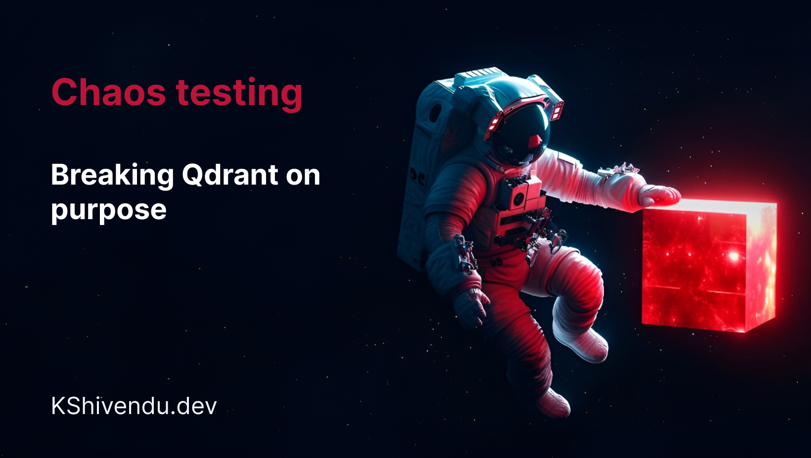
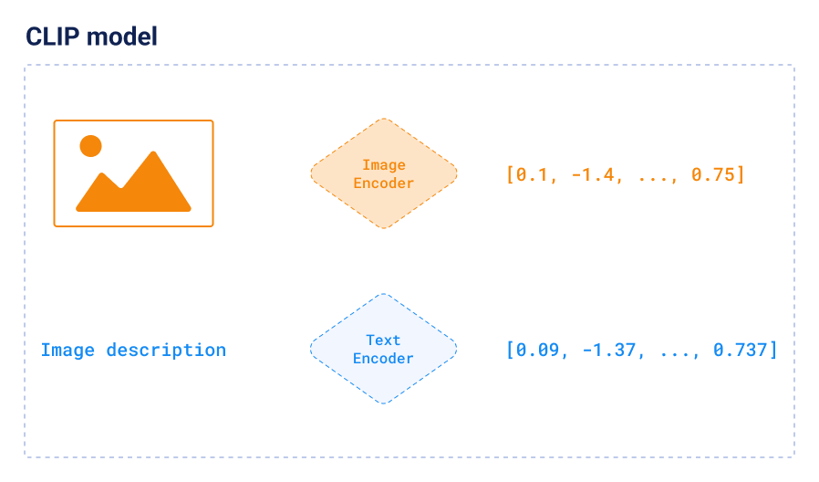
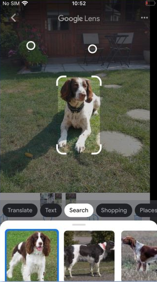
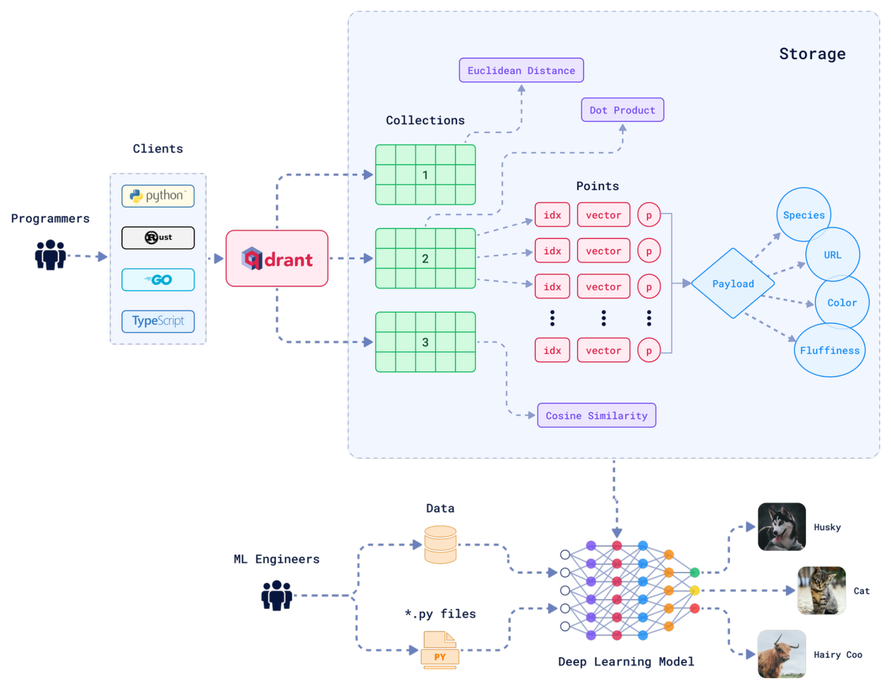
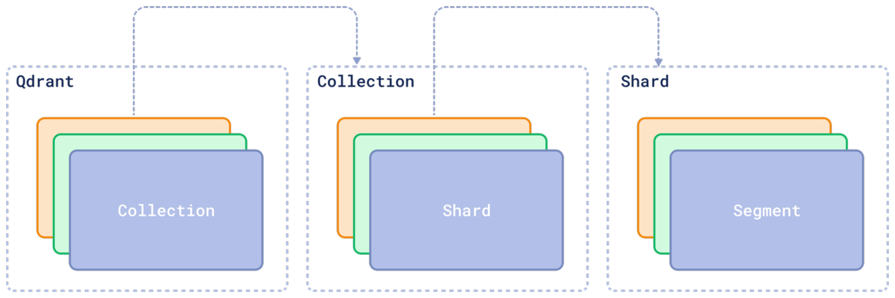
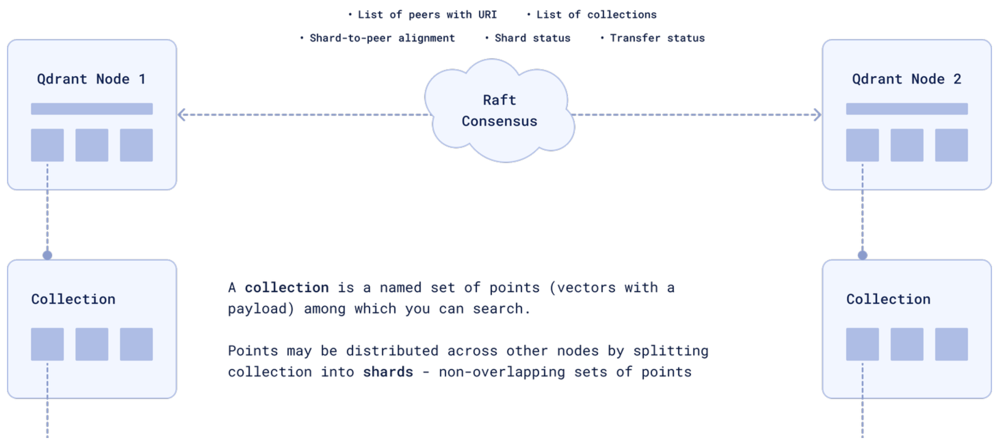
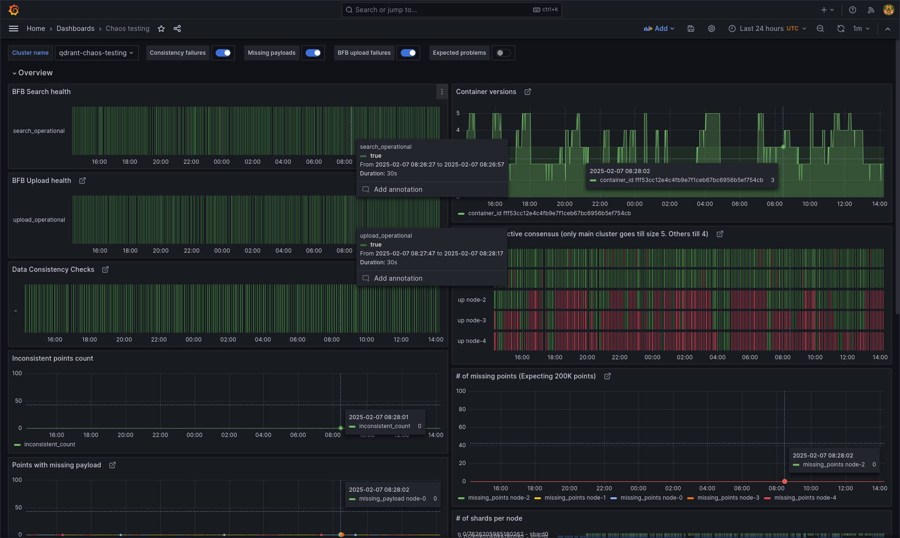

---

## $ whoami


* Kumar Shivendu

* Engineer @ Qdrant

* I ❤️ search, distributed systems, and LLMs.

* Chaos testing: Breaking Qdrant on purpose

<!-- * RAG = Retreival Augment Generation -->
---

## Topics to cover

* Intro to vectors and vector search
* Overview of Qdrant
* Why we needed chaos testing?
* Different components of chaos testing
* Results

---

## Vectors

* Points in an N-dim space
* Compressed **meaning**
* Anything -> Vector
* Popular ways to generate:
  * Language/vision models
  * Metric learning
    * CLIP



---

## Vector search



* Keyword search
  * Doc miss (low recall)
  * Can't do img, audio, etc
* Things, not strings
* Nearest points
* Indexing and approximation
* Problem: Hard to scale and manage.

<!-- Image showing vector search -->
---

## What is **Qdrant**


* Open Source Vector Search Engine (aka Vector DB)

* 21k+ stars on Github

* Written in Rust 🦀

* SDKs for Python, JS, Go, Java, etc

* X.com, Perplexity, Meesho, Flipkart

---

## Indexing:

```js
PUT /collections/rentals/points
{
  "batch": {
    "ids": [1, 2],
    "vectors": [
      [0.9, -0.5, ..., 0.0], // generated from rental1.jpg using ML model
      [0.1, 0.4, ..., 0.3],
    ],
    "payload": [
      {"city": "Bangalore", "sqft": 990, "img_url": "example.com/rental1.jpg", "tags": ["..."]},
      {"city": "Hyderabad", "sqft": 1550, "img_url": "example.com/rental2.jpg", "description": "..."},
    ]
  }
}
```

---

## Search:

```js
POST /collections/rentals/points/search
{
  "query": [0.2, 0.3, ..., 0.4], // generated from user query (text) using same model
  "filter": { "must": [{"key": "city", "match": {"value": "Bangalore"}}] },
  "limit": 10
}
```

* ```js
  [
    {"id": 4, "score": 0.56, "payload": {...}},
    {"id": 2, "score": 0.40, "payload": {...}},
    {"id": 5, "score": 0.23, "payload": {...}},
  ]
  ```

---

### Architecture



---


### Data persistence



----

### Cluster mode



<!-- ---
### What kind of tests we run already?

- Unit tests
- Integration tests
- Misc.
    - Storage compatibility
    - API
    -
- Crasher
- Most of these tests run on linux, mac, and windows -->

---

### Why chaos testing?

* Catch/fix bugs before users.
* Moving parts of a distributed system:
    * Consensus, segments,  sharding, storage, WAL, HNSW index, etc.
    * When deployed: k8s, operator, disk, backward compatibility, etc.
* **Anything** can fail. We must prepare for the worse
* Impossible to write tests for every possible scenario
* 💡 Test Qdrant in some of the worst possible scenarios

---

### Why existing solutions weren't enough

* Most solutions felt limited for a DB use case while being bloated
* Needed custom cluster setup, checks, and more.
* Simplicity >>>
* Already built tools like `bfb` in-house

---

### Qdrant cluster ☁️

* Cloud-like env using k8s.
* Build and deploy container for every merge to `dev`
* Operator -> Cluster Manager -> Qdrant cluster
* Qdrant k8s operator + Cluster manager (CM)
    * Scale, Replicate, Re-shard, and Balance shards.
    * Only CM knows about Qdrant internals
        * consensus, sharding, indexing, etc

---

### Load generator 🔨

* Custom tool: `bfb`
* Constantly hammering the cluster
* Runs in both modes:
    * Upserts
    * Search

---

### Chaos crons 🌪️

* Bring chaos:
    * Kill:
        * every 5 mins; triggers shard recovery
    * Scale up/down:
        * adds/removes nodes; triggers shard movement
    * Snapshot:
        * import/export data in bulk; Slows down the nodes
    * Resharding:
        * splits/merges shards; Migration of data

---

### Healthcheck crons 🩺

*  Check for degradations:
    * Points are present
    * Points are consistent
    * Nodes and shards are healthy, readable, and writable

---

### Monitoring 📊

* Integrate data from Loki, Prometheus, Postgres, etc
* Monitor uptime, data consistency checks, system resources, etc.



---

### Results 🚀

* Fixed 20+ hard-to-reproduce / critical bugs since we started (10 Feb 2024)
* Chaos testing is technically the "production" for the core team.
* What doesn't kill you, makes you stronger!
<!-- * If Qdrant thrives here, it's very much ready for the real world! -->

---


### Summary

* It's impossible to test every possible scenario by writing tests for each combination.
* Complex systems can have some critical bugs that are reproduced when multiple conditions meet.
* Chaos is about embracing randomness so that stars align and you hit just the spot.

* Find me at
  * [kshivendu.dev/twitter](kshivendu.dev/twitter)


<!--
Further reading:
- https://medium.com/llamaindex-blog/boosting-rag-picking-the-best-embedding-reranker-models-42d079022e83
- https://www.rungalileo.io/blog/mastering-rag-how-to-select-a-reranking-model
-->
