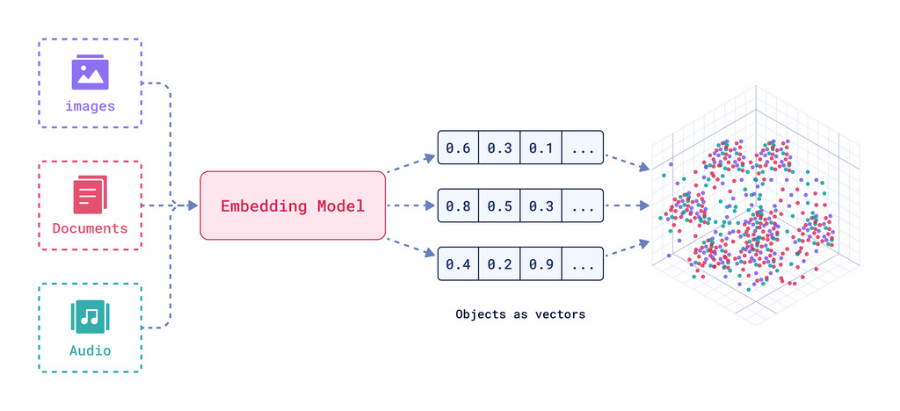

---

## $ whoami


* Kumar Shivendu

* Engineer @ Qdrant

* I ❤️ search & distributed systems.

* Beyond Filters: Modern Search (and more) with Vectors in Django


---

## Topics to cover

* Traditional search in Django
* Intro to vectors and vector search
* Overview of Qdrant
* Django integration of Vector DBs
* Tradeoffs & limits of vector search
* Usecases beyond text search
* Summary

---

### Search with Postgres (Substring match)

```py
# DB model
class Product(models.Model):
    name = models.CharField(max_length=255)
    description = models.TextField()
    price = models.DecimalField(max_digits=10, decimal_places=2)

    class Meta:
        indexes = [models.Index(fields=["price"])]
                                                                                                                  |
# Query:
products = Product.objects.filter(
    (Q(name__icontains="toy") | Q(description__icontains="toy")) & Q(price__lte=100)
)
```

* Cons:
    * Naive.
    * Slow. It's doing full scan.

---

### Search with Postgres (GIN)


```py
class Product(models.Model):
    # ...
    class Meta:
        # In simple terms, GIN = A map of term/token -> list of document IDs
        # {"toy": [p1, p2], "soft": [p1]}
        indexes = [models.Index(fields=["price"]), GinIndex(fields=["name"]), GinIndex(fields=["description"])]

# Queries:
products = Product.annotate(
    search=SearchVector("name", "description"),
).filter(Q(search="toy") & Q(price__lte=100))
```

* Cons:
    * Slower DB writes (more indices to update).
    * No typo tolerance, facets, boosting fields, etc.

---

### Search with Elasticsearch

```py
from django_elasticsearch_dsl import Document, Index, fields

product_index = Index("products") # Creates a "table" equivalent
product_index.settings(number_of_shards=1, number_of_replicas=0)
                                                                                                                                                                   |
@product_index.doc_type
class ProductDocument(Document):
    name = fields.TextField()
    description = fields.TextField()
    price = fields.FloatField()

    class Django:
        model = Product # Refers to our Django model
        fields = ["id"]

products = ProductDocument.search()
    .query("multi_match", query="toy", fields=["name", "description"])
    .filter("range", price={"lte": 100}).execute()
```

* Cons:
    * `"user login" ≠ "authentication"`
    * Synonyms need manual work to manage.
    * Can't search images, videos, audio.

---

## Vectors

* Points in an N-dim space
* Compressed **meaning**
* Anything -> Vector
* Popular ways to generate:
  * Language/vision models (GPT)
  * Metric learning
    * CLIP



---

## Vector search


* Things, not strings
* Keyword search
  * Doc miss (low recall)
  * Can't do img, audio, etc
* Nearest points
* Indexing and approximation
* Problem: Hard to scale and manage.

<!-- Image showing vector search -->
---

## What is **Qdrant**


* OSS Vector Search Engine

* 25k+ stars on Github

* Written in Rust 🦀

* SDKs for Python, JS, Go, Java, etc

* X.com, Discord, HubSpot, Flipkart

---

## Indexing:

```js
PUT /collections/rentals/points
{
  "batch": {
    "ids": [1, 2],
    "vectors": [
      [0.9, -0.5, ..., 0.0], // generated from rental1.jpg using ML model
      [0.1, 0.4, ..., 0.3],
    ],
    "payload": [
      {"city": "Bangalore", "sqft": 990, "img_url": "example.com/rental1.jpg", "tags": ["..."]},
      {"city": "Hyderabad", "sqft": 1550, "img_url": "example.com/rental2.jpg", "description": "..."},
    ]
  }
}
```

---

## Search:

```js
POST /collections/rentals/points/search
{
  "query": [0.2, 0.3, ..., 0.4], // generated from user query (text) using same model
  "filter": { "must": [{"key": "city", "match": {"value": "Bangalore"}}] },
  "limit": 10
}
```

* ```js
  [
    {"id": 4, "score": 0.56, "payload": {...}},
    {"id": 2, "score": 0.40, "payload": {...}},
    {"id": 5, "score": 0.23, "payload": {...}},
  ]
  ```

---

### Django integration with Vector DBs

* `pip install django-semantic-search[qdrant,sentence-transformers]`

* ```py
  SEMANTIC_SEARCH = {
      "vector_store": {
          "backend": "django_semantic_search.backends.qdrant.QdrantBackend",
          "configuration": {
              "location": "http://localhost:6333",
          },
      },
      "default_embeddings": {
          "model": "django_semantic_search.embeddings.SentenceTransformerModel",
          "configuration": {
              "model_name": "sentence-transformers/all-MiniLM-L6-v2",
          },
      },
  }
  ```

---

### Django integration with Vector DBs

```py
from django_semantic_search import Document, VectorIndex, register_document
from books.models import Book

@register_document
class ProductDocument(Document):
    class Meta:
        model = Book
        indexes = [
            VectorIndex("title"),
            VectorIndex("description"),
        ]

# Queries:
results = ProductDocument.objects.search(title="toy")
```

---
### Tradeoffs and limits of vector search

* Lower p99 latency & relevant results at scale.
    * Tradeoff: Higher cost & indexing time.
    * Can be tuned by changing HNSW index config, quantization, & off loading to disk.
* Can't search for IDs like `TOY_XYZ123` (can be fixed with simple filtering)
* Need dedicated models in domains with lots of unknown terms (ex: legal & medical) (these days they are in abundance)
* Although rare, model upgrade needs re-indexing of the whole dataset.

---
### Beyond text search:

* Multi modal search
* Recommendations
* Content discovery
* Clustering
* Anomaly detection
* RAG

---


### Summary

* Vectors represent the **meaning** of given text/image/video/audio.
* Vectors unlock **new paradigms for search**: multi-modal search, recommendations, exploration, anomaly detection, etc.
* Vector DBs make it easy to manage vectors at scale. They allow tuning between quality, cost, and latency of search.

* Find me at
  * [kshivendu.dev/twitter](kshivendu.dev/twitter)

<!-- Need to update QR with new Qdrant colors #DC244C -->

