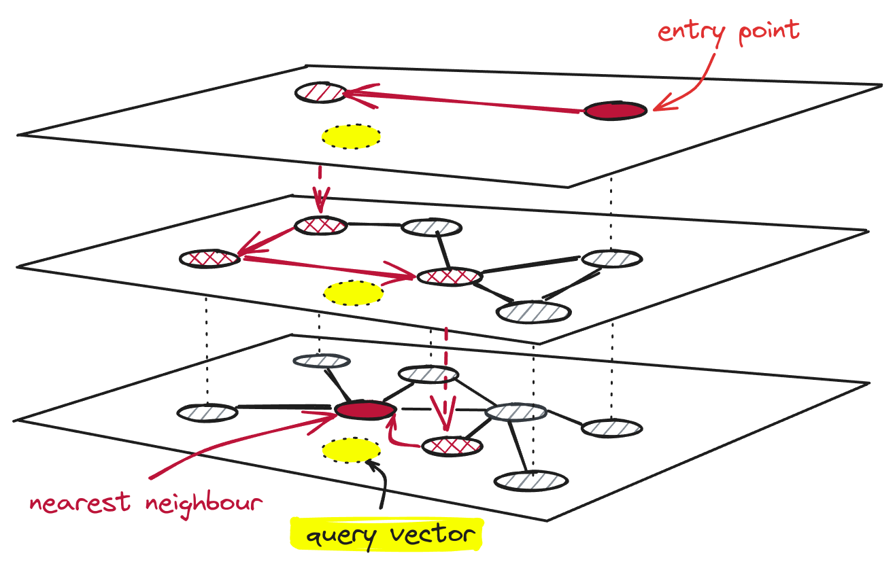

---

## $ whoami


* Kumar Shivendu (India 🇮🇳)

* 1st international talk!

* Engineer @ Qdrant

* I've used Django in most of my roles and I've built search at billion scale.

* Beyond Filters: Modern Search (and more) with Vectors in Django


---

## Topics to cover

* Traditional search in Django
* Intro to vectors and vector search
* Overview of Vector DBs & HNSW Index
* Django integration of Vector DBs
* Tradeoffs & limits of vector search
* Usecases beyond text search
* Summary

---

### Search with Postgres (Substring match)

```py
# DB model
class Product(models.Model):
    name = models.CharField(max_length=255)
    description = models.TextField()
    price = models.IntegerField()

    class Meta:
        indexes = [models.Index(fields=["price"])]
                                                                                                                  |
# Query: User wants to search for toys
products = Product.objects.filter(
    (Q(name__icontains="laptop") | Q(description__icontains="laptop")) & Q(price__lte=2000)
)
```

* Cons:
    * Slow. Full scan. No dedicated index
    * No understanding of language. Misses `notebook`

---

### Search with Postgres (GIN)


```py
class Product(models.Model):
    name = models.CharField(max_length=255)
    description = models.TextField()
    price = models.IntegerField()

    class Meta:
        # In simple terms, GIN = A map of term/token -> list of document IDs
        # {"laptop": [p1, p2], "notebook": [p1]}
        indexes = [models.Index(fields=["price"]), GinIndex(fields=["name"]), GinIndex(fields=["description"])]

# Queries:
products = Product.annotate(
    search=SearchVector("name", "description"),
).filter(Q(search="laptop") & Q(price__lte=2000))
```

* Cons:
    * Slower DB writes (more indices to update).
    * No typo tolerance, facets, boosting fields, etc.

---

### Search with Elasticsearch

```py
from django_elasticsearch_dsl import Document, Index, fields

product_index = Index("products") # Creates a "table" equivalent
product_index.settings(number_of_shards=1, number_of_replicas=0)
                                                                                                                                                                   |
@product_index.doc_type
class ProductDocument(Document):
    name = fields.TextField()
    description = fields.TextField()
    price = fields.FloatField()

    class Django:
        model = Product # Refers to our Django model
        fields = ["id"]

products = ProductDocument.search()
    .query("multi_match", query="toy", fields=["name", "description"])
    .filter("range", price={"lte": 100}).execute()
```

* Cons:
    * `"user login" ≠ "authentication"`
    * Synonyms need manual work to manage.
    * Can't search images, videos, audio.

---

## Vectors

* Points in an N-dim space
* Compressed **meaning**
* Anything -> Vector
* Was only accessible only to big tech:
  * Language/vision models (GPT)
  * Metric learning
    * CLIP


---

## Vector search


* Google lens & Spotify recommendations
* Things, not strings
* Keyword search
  * Doc miss (low recall)
  * Can't do img, audio, etc
* Nearest points
* Indexing and approximation
* Problem: Hard to scale and manage.

<!-- Image showing vector search -->
---

## What is **Qdrant**


* OSS Vector Search Engine

* 25k+ stars on Github

* Written in Rust 🦀

* SDKs for Python, JS, Go, Java, etc

* X.com, Discord, HubSpot, Flipkart

---

## The HNSW Index



* Skip Lists + Graphs
* Approximate and Tunable
* Filter during search
* Quantization

---

### Creating a collection:

```js
// HTTP APIs:
PUT /collections/product
{
  "vectors": {
    "distance": "Cosine", // Euclid, Dot
    "size": 384 // dimension of your vector (generated from description of the product).
  }
}
```

* ```js
  // Creating index on your fields
  PUT /collections/product/index
  {
      "field_name": "price",
      "field_schema": "integer" // keyword, geo, datetime, text, float, bool
  }
  ```

<!--
```py
# docker run -p 6333:6333 qdrant/qdrant

from qdrant_client import QdrantClient
from qdrant_client.models import Distance, VectorParams

client = QdrantClient(url="http://localhost:6333")
client.create_collection(
    collection_name="test_collection",
    vectors_config=VectorParams(size=4, distance=Distance.DOT),
)
```
-->

---

## Upsert:

```js
PUT /collections/product/points
{
  "batch": {
    "ids": [1, 2],
    "vectors": [
      [0.9, -0.5, ..., 0.0], // generated from "description" field using ML model
      [0.1, 0.4, ..., 0.3],
    ],
    "payload": [
      {"brand": "Samsung", "price": 990, "img_url": "example.com/samsung.jpg", "description": "..."},
      {"brand": "Apple", "price": 1550, "img_url": "example.com/apple.jpg", "description": "..."},
    ]
  }
}
```
<!--
* Note: Could have generated vectors for image and stored along with `description` vector -->

---

## Search:

```js
POST /collections/product/points/search
{
  "query": [0.2, 0.3, ..., 0.4], // generated from user query (text) using same model
  "filter": { "must": [{"key": "price", "range": {"lte": 2000}}] },
  "limit": 10
}
```

* ```js
  [
    {"id": 4, "score": 0.56, "payload": {...}},
    {"id": 2, "score": 0.40, "payload": {...}},
    {"id": 5, "score": 0.23, "payload": {...}},
  ]
  ```

---

### Django integration with Vector DBs

* `pip install django-semantic-search[qdrant,sentence-transformers]`

* ```py
  SEMANTIC_SEARCH = {
      "vector_store": {
          "backend": "django_semantic_search.backends.qdrant.QdrantBackend",
          "configuration": {
              "location": "http://localhost:6333",
          },
      },
      "default_embeddings": {
          "model": "django_semantic_search.embeddings.SentenceTransformerModel",
          "configuration": {
              "model_name": "sentence-transformers/all-MiniLM-L6-v2",
          },
      },
  }
  ```

---

### Django integration with Vector DBs

```py
from django_semantic_search import Document, VectorIndex, register_document
from movies.models import Movie

@register_document
class MovieDocument(Document):
    class Meta:
        model = Movie
        indexes = [
            VectorIndex("plot")
        ]

# Queries:
# Note how queries can now be very natural.
results = MovieDocument.objects.search(plot="Movies where AI becomes sentient")
```

---


### Tradeoffs wrt keyword search

* Cost is higher
    * Indexing is compute heavy. More RAM.
    * Predictable latency distribution (lower p99) than keyword search
    * Relevant results: Happier users. Increases revenue if done right
    * Tuned by changing HNSW index config, quantization, and off-loading vectors to disk.

---

### Limits of pure vector search

* Struggles when it sees too many unknown terms
    * Can't search for IDs like `PRODUCT_XYZ123`
    * Need dedicated models in domains with lots of unique terms (ex: legal & medical)
    * Combine with keyword search / filtering to handle such cases easily.

---

### Beyond simple search:

* Multi modal search
* Recommendations
* Content discovery
* Clustering
* Anomaly detection
* RAG

---


### Summary

* Vector search is faster at scale and more relevant.
* Vectors unlock **new paradigms for search**: multi-modal search, recommendations, exploration, anomaly detection, etc.
* Vector search engines are great if you're running at scale (1M+). They allow tuning between quality, cost, and latency of search.

* Find me at [kshivendu.dev/twitter](kshivendu.dev/twitter)
* Thank you! Questions?

<!-- Need to update QR with new Qdrant colors #DC244C -->

