<!--  -->
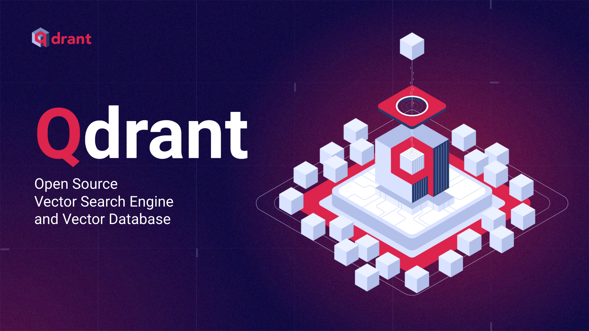


---

## $ whoami


* Kumar Shivendu

* Software Engineer @ Qdrant

* I ❤️ information retrieval, performance, and data mining.

* First talk!

* Qdrant: Future of search and beyond

<!-- ---

## Topics to cover

* Evolution of search
  * Traditional approaches and drawbacks
  * Vectors search and how it harnesses ML models

* Qdrant
  * Building HNSW index and vector search
  * Beyond similarity search:
    * Recommendations
    * Discovery
  * Sparse vectors -->

---

## Traditional ways to build search

* Approaches:
  * Keyword match, Regex, Boolean operators
  * Extracting metadata using NLP and CV
  * Knowledge graphs, Vocabs

* Challenges:
  * Extra work required to maintain the knowledge
  * Growing amount of unstructured data everywhere
  * Multimodal search remains hard: Text, Image, Audio, Video

---

## Vectors

* Points in an N-dimensional space
* Anything -> Vector
* Generated from:
  * ML models
  * Metric learning
* CLIP

<!-- Replace search space image -->
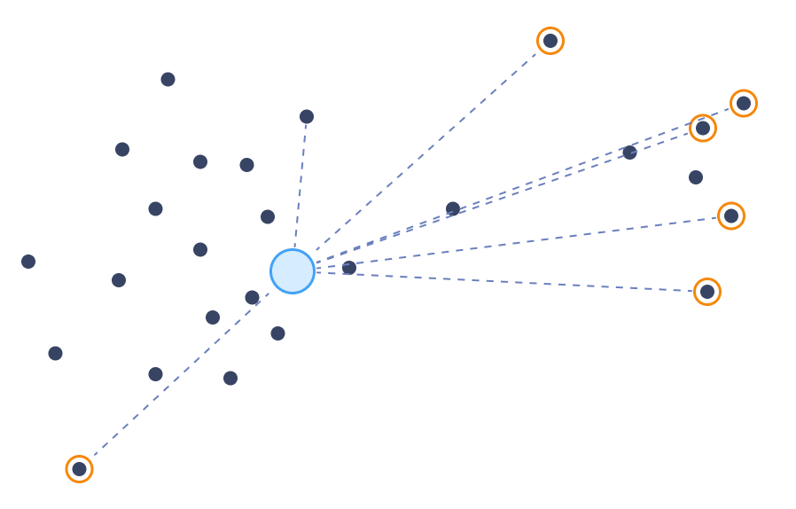
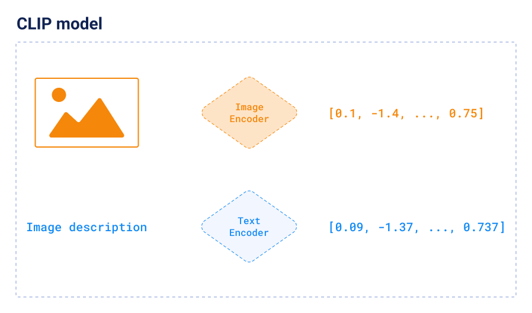


---

## Vector search


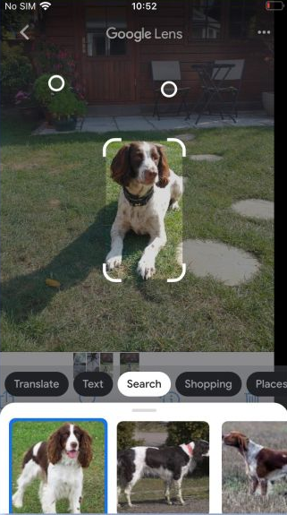

* Nearest points
* Example: Google Lens
* But this is expensive and not easy to scale
* Solution: Indexing and approximation

<!-- Image showing vector search -->

<!-- FIX this image. The arrows are broken -->


---

## What is **Qdrant**


* Vector Search Engine (aka Vector DB)

* 15k+ stars on Github

* Written in Rust 🦀

* SDKs for Python, JS, Go, Java, etc

* Twitter, Canva, Meesho, Flipkart

---

## The HNSW Index

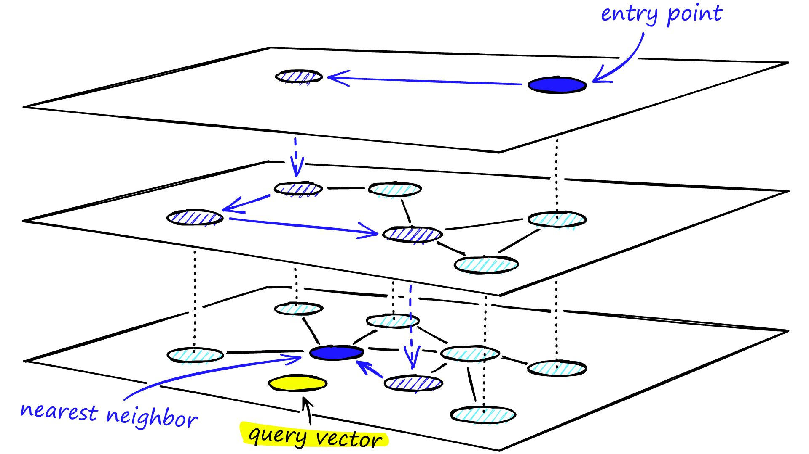

* Skip Lists + Graphs
* Approximate and Tunable
* Filter during search
* Quantization

---

## Running search:

```js
POST /collections/rentals/points/search
{
  "query": [0.2, 0.3, 0.4, 0.5], // vector generated from image/text/video
  "filter": { "must": [{"key": "locality", "match": {"value": "Indiranagar"}}] },
  "limit": 10
}
```

* ```js
  [
    {"id": 4, "score": 0.56, "payload": {...}},
    {"id": 2, "score": 0.40, "payload": {...}},
    {"id": 5, "score": 0.23, "payload": {...}},
  ]
  ```

---

## Beyond search: Recommendations

* Realtime addition of points is possible.
* `average_vector` and `best_score`
* ```js
  POST /collections/rentals/points/recommend
  {
    "positive": [100, 231], // vector ids
    "negative": [718, [0.2, 0.3, 0.4, 0.5]], // vector id and vector
    "filter": { "must": [{"key": "locality", "match": {"value": "Indiranagar"}}] },
    "strategy": "best_score",
  }
  ```
* DailyMotion (Qdrant), Spotify (Annoy)

---
## How to find this thing on the internet?

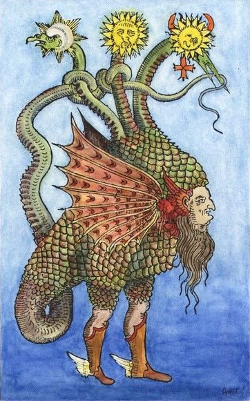

* No reverse image search
* No known name

---
## Strategy One

* Describe the thing
  * "Combination of human, dragon and chicken"
  * "Mythology creature of human and dragon"

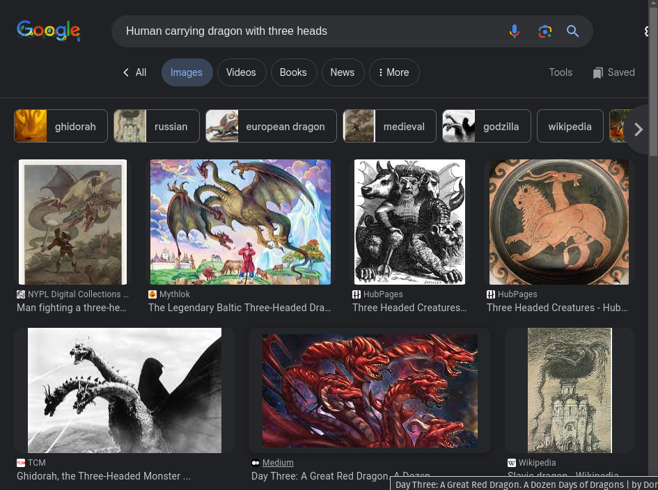

---
## Strategy Two

* Search for similar images
  * Similarity bubble

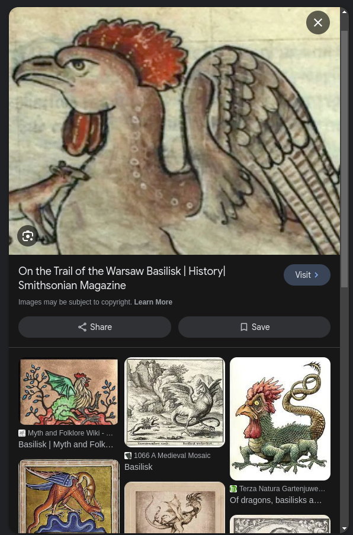
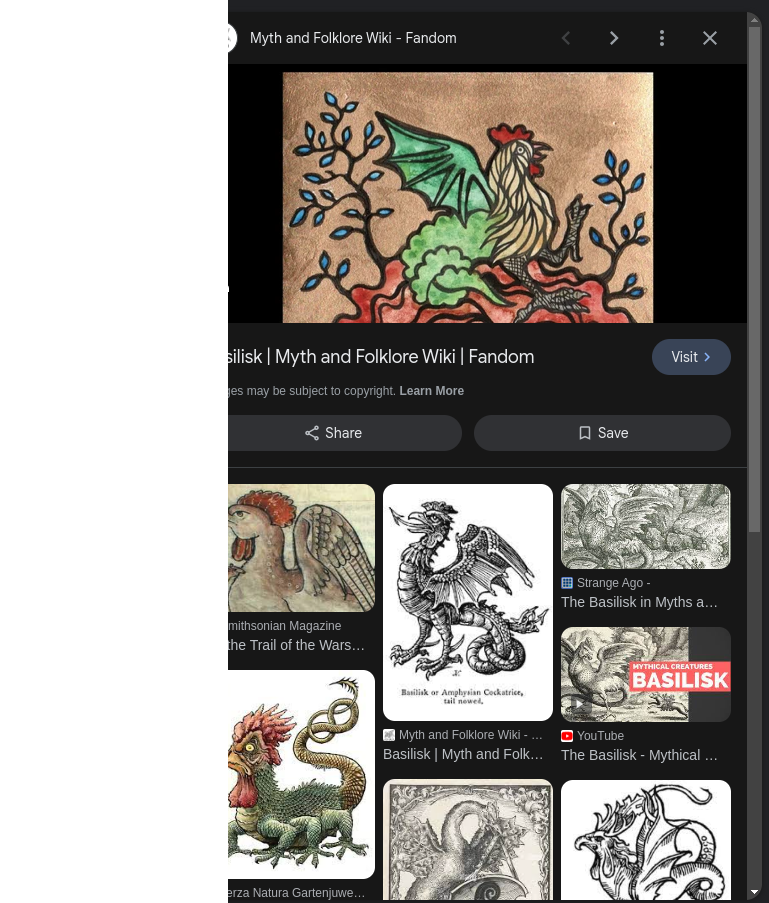

---

## Beyond search: Discovery API

* Unique iterative search by Qdrant
* Combine multi-modal vectors in single query

* ```js
  POST collections/my-collection/points/discover
  {
    "target": [0.63, 0.10, 0.91, 0.55],
    "context": [
      {
        "positive": 7125, // <-- ID of the example
        "negative": 122   // <-- This can also be a vector
      }
    ],
  }
  ```

---
<!-- ---

## How discovery uses that?

##### Remember Metric Learning?


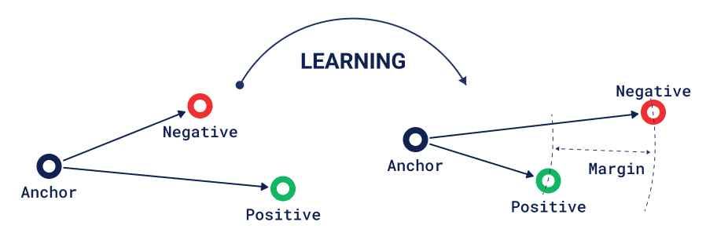

---
-->


<!-- 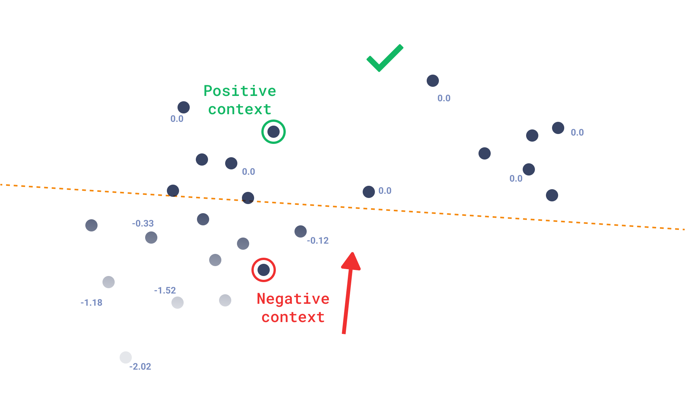

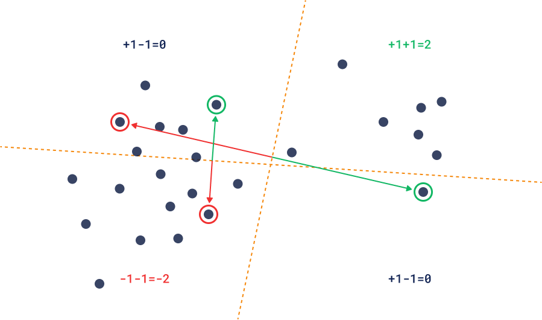

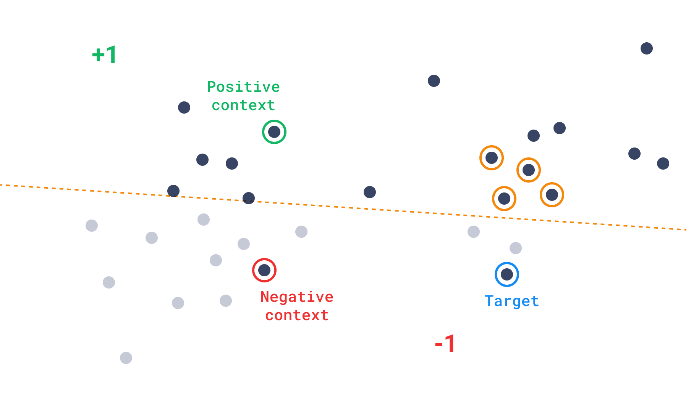

--- -->

<!--
## How multi-modal embeddings look like?


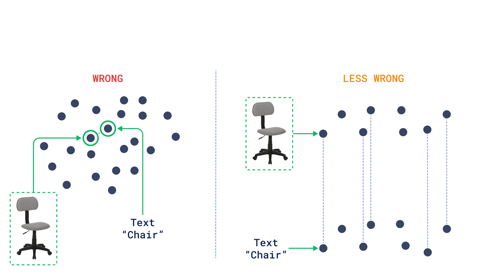


---

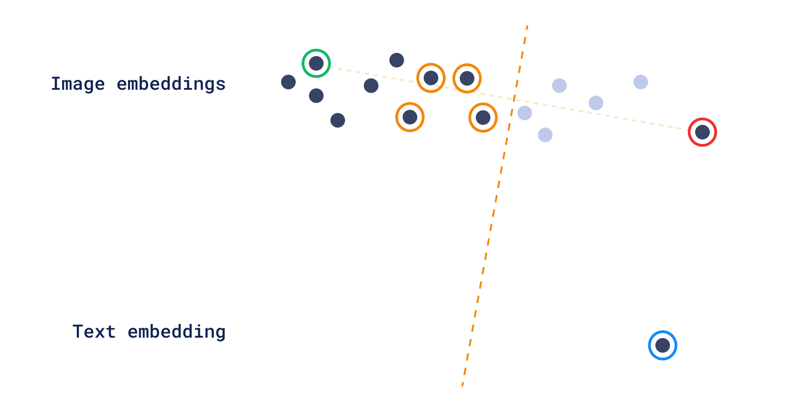


---


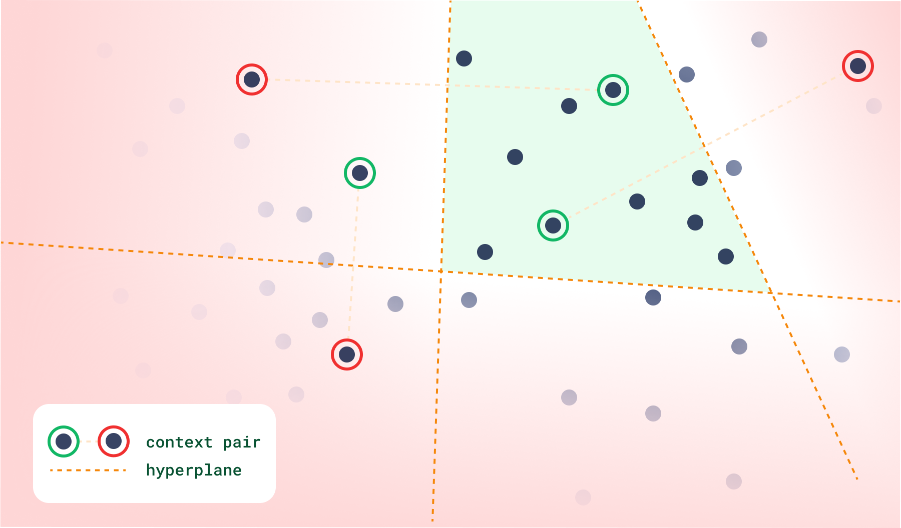

--- -->

<!-- ## Sparse vectors

* VS text search
* BM25 & TF-IDF
* Transformer's attention weights
* SPLADE

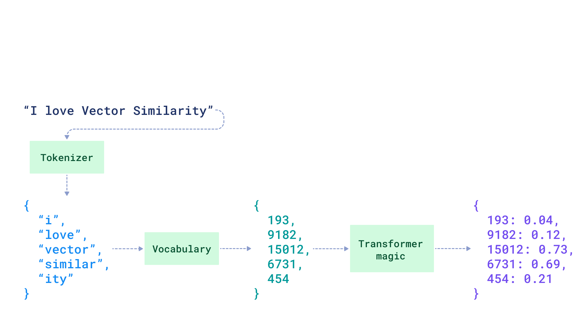

--- -->

# Summary

* Anything => vector

* Vectors >> similarity search

* Thousands of use-cases with Qdrant

<!-- * Navigating search (read vector) space is powerful! -->

* Find me at
  * kshivendu.dev/bio
  * kshivendu.dev/twitter


<!-- * Thank you! -->

