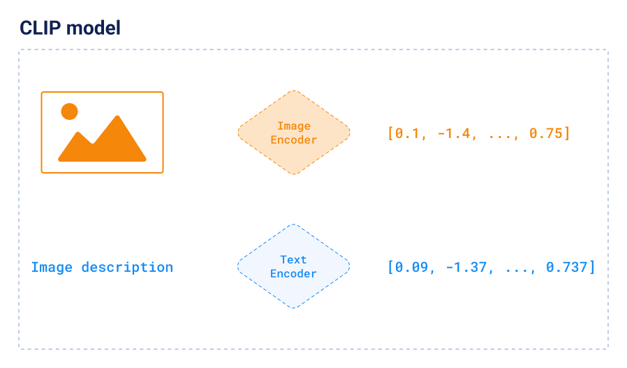

---

## Speakers


* Ivan Pleshkov:
    * All things indexing & search at Qdrant
* Kumar Shivendu:
    * Cluster manager service, chaos testing, and benchmarks

* Topic: Vendor Agnostic GPU vector indexing

---

## Topics to cover

* Intro to vectors and vector search
* HNSW algorithm
* Why we need GPU indexing?
* Brief intro to Vulkan API <!-- Ivan's part -->
* How we ported HNSW to Vulkan API  <!-- Ivan's part -->
* Challenges faced <!-- Ivan's part -->
* Benchmarks: Performance and Cost
* Takeaways
---

## Vectors

* Points in an N-dim space
* Compressed **meaning**
* Anything -> Vector
* Popular ways to generate:
  * Language/vision models
  * Metric learning
    * CLIP



---

## Vector search


* Things, not strings
* Keyword search
  * Doc miss (low recall)
  * Can't do img, audio, etc
* Nearest points
* Indexing and approximation
* Problem: Hard to scale and manage.

<!-- Image showing vector search -->
---

## What is **Qdrant**


* Open Source Vector Search Engine (aka Vector DB)

* 21k+ stars on Github

* Written in Rust 🦀

* SDKs for Python, JS, Go, Java, etc

* X.com, Perplexity, Meesho, Flipkart

---

## Indexing:

```js
PUT /collections/rentals/points
{
  "batch": {
    "ids": [1, 2],
    "vectors": [
      [0.9, -0.5, ..., 0.0], // generated from rental1.jpg using ML model
      [0.1, 0.4, ..., 0.3],
    ],
    "payload": [
      {"city": "Bangalore", "sqft": 990, "img_url": "example.com/rental1.jpg", "tags": ["..."]},
      {"city": "Hyderabad", "sqft": 1550, "img_url": "example.com/rental2.jpg", "description": "..."},
    ]
  }
}
```

---

## Search:

```js
POST /collections/rentals/points/search
{
  "query": [0.2, 0.3, ..., 0.4], // generated from user query (text) using same model
  "filter": { "must": [{"key": "city", "match": {"value": "Bangalore"}}] },
  "limit": 10
}
```

* ```js
  [
    {"id": 4, "score": 0.56, "payload": {...}},
    {"id": 2, "score": 0.40, "payload": {...}},
    {"id": 5, "score": 0.23, "payload": {...}},
  ]
  ```

---

### Hierarchical Navigable Small World

* Skip list + graph

---

### Why GPU indexing?

* Many use cases have constant upserts:
    * News, social media, e-commerce
* Large enough updates require HNSW (re)-construction.
* Index rebuilding is computationally expensive and affects search
* More CPUs => faster indexing + higher cost
* GPUs can index even faster => faster indexing + lower cost

---

### Why build in-house solution?

* cuVS: NVIDIAs library for vector search & cluster on GPU
* Decent solution. But had drawbacks:
    * Constructs only Vamana, IVF, and CARGA, **not HNSW**. <!-- Let alone our customizations in the HNSW algorithm  -->
    * No support for multi vector models (ColBERT, ColPali, etc)
    * Missing support for quantization (Scalar, binary, and product)
    * We **don’t want to rely on a single GPU vendor**.
* Example: AWS offers affordable AMD GPU instances
* GPU acceleration needs to fit **our architectural choices** so it scales in production

---

### Vulkan API

* The **next-generation of OpenGL** and a open standard (We ❤️ OSS)
* It’s hardware-independent, and runs on any modern GPU: NVIDIA, AMD, Intel, Apple Silicon, and more
* Low-level and enables advanced optimizations, like custom GPU memory allocation
* Powerful but painful:
    * Basic triangle render in C takes 1,000+ lines of code
    * Difficult to debug and limited debugger ecosystem
    * Requires handling extensions, features, and flags

---

### GLSL

* Vulkan runs on CPU, and we needed a way to run computations on the GPU. We chose GLSL shaders, compiled with `glslc`.

* GLSL also comes with challenges:
    * Complex than CUDA — no built-in tooling for compute tasks
    * No debugger or breakpoints — hard to inspect execution
    * No stdout - can't even use simple print statements
    * No dynamic allocations or built-in collections — requires careful memory management

---

### Outcome: No pain, no gain 🚀

* X months of hardwork. Released with Qdrant `v1.13`
* Seamless CPU compatibility – No trade-offs;
* Works with our custom HNSW – For precise vector search at scale;
* All quantization methods supported – Scalar, binary, product quantization;
* Supports multi-vector models – Optimized for ColBERT, ColPali & ColQwen;
* Multi-GPU ready – Automatically detects and scales across all available GPUs.

---

### Benchmark setup

* Measure the indexing of 1 million OpenAI embeddings (1536 dims)
* Upload all data with indexing turned off.
* Turn indexing on and wait for the process to complete.
* This benchmark includes all IO operations to reflect a real-world scenario.

---

### Benchmark results

| Instance       | Specs                             | Indexing Time                   | $/hr              | $ per index     |
|----------------|-----------------------------------|---------------------------------|-------------------|-----------------|
| c8g.4xlarge    | 32GB RAM, 16 vCPU                 | 290s                            | $0.636            | $0.051          |
| g4dn.2xlarge   | 32GB RAM, 8 vCPU, Nvidia T4       | 165s                            | $0.752            | $0.034          |
| g4ad.2xlarge   | 32GB RAM, 8 vCPU, Radeon Pro V520 | 140s                            | $0.541            | $0.021          |

---

### Local setup:

* ```py
  # NVIDIA:
  docker run --gpus=all -p 6333:6333 -p 6334:6334 -e QDRANT__GPU__INDEXING=1 qdrant/qdrant:gpu-nvidia-latest
  # AMD:
  docker run --gpus=all -p 6333:6333 -p 6334:6334 -e QDRANT__GPU__INDEXING=1 qdrant/qdrant:gpu-amd-latest
  ```
* ```py
  # Any GPU:
  git clone https://github.com/qdrant/qdrant
  # Set gpu.indexing: true in config.yaml
  cargo run --release --features gpu
  ```

<!-- * 
    * Runs on Streamdeck! -->
---

### Fun fact:

* Can even run on your StreamDeck AMD GPU. Vector search ftw!!


---

### Takeaways

* For workloads with frequent updates, using GPUs can be more economical than CPUs.
* Vulkan API is hard to tame but gives you vendor agnostic capabilities.
* Vector search technology is still evolving. Lot of scope for optimizations!
    <!-- * Our dedicated Docker images — `qdrant/qdrant:gpu-nvidia-latest` and `qdrant/qdrant:gpu-amd-latest` — ensure a smooth setup. -->
<!-- * CPU Compatibility: Start using GPU acceleration without any changes to your data. Switching back to CPU is just as straightforward -->

* Find us at
  * [ivan.com/twitter](ivan.com/twitter)
  * [kshivendu.dev/twitter](kshivendu.dev/twitter)


