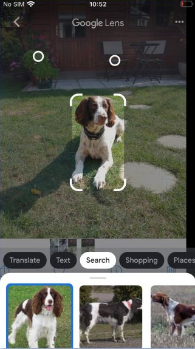

---

## $ whoami


* Kumar Shivendu

* IIT Bhilai 2022 CS Grad

* President @ IITBh Alumni Association

* Engineer @ Qdrant

* I ❤️ search, databases, and distributed systems.

* Qdrant: Internals of a vector database

<!-- * RAG = Retreival Augment Generation -->
---

## Topics to cover

* Intro to vectors and vector search
* Overview of Qdrant
* Qdrant vs RDBMS
* HNSW Index vs B-tree
* Qdrant distributed mode
* What's hard about building a database?
* Trends and jobs DB industry
* Q/A & Word Cloud

---

## Vectors

* Points in an N-dim space
* Compressed **meaning**
* Anything -> Vector
* Popular ways to generate:
  * Language/vision models
  * Metric learning
    * CLIP


---

## Vector search



* Things, not strings
* Keyword search
  * Doc miss (low recall)
  * Can't do img, audio, etc
* Nearest points
* Indexing and approximation
* Problem: Hard to scale and manage.

<!-- Image showing vector search -->
---

## What is **Qdrant**


* Open Source Vector Search Engine (aka Vector DB)

* 26k+ stars on Github

* Written in Rust 🦀

* SDKs for Python, JS, Go, Java, etc

* X.com, Perplexity, Meesho, Flipkart, Discord, Quora, Canva

---

### Workflow


---

### Qdrant vs RDBMS (Postgres/MySQL)

* **Document data model** like MongoDB/Elasticsearch
* NO schema, foreign keys, or joins => NO concept of normalization (Use arrays instead)
* Built for **vector** search, classification, anomaly detection, and recommendations (NOT financial accounting)
* Highly scalable: In-built features like sharding and consensus to scale horizontally as a distributed cluster (harder in RDBMS)
* Search Engine; NOT recommended as primary source of truth.
* Queried via HTTP/gRPC endpoints instead of SQL (TCP)
    * NoSQL DB: Very bad terminology

---

### Creating a collection/table:

```js
PUT /collections/rentals
{
  "vectors": {
    "size": 300,
    "distance": "Cosine"
  }
}
```

* SQL equivalent needs a schema
    ```sql
    CREATE TABLE rentals (
      id INTEGER PRIMARY KEY, vector FLOAT[], city TEXT,
      sqft INTEGER, img_url TEXT, tags TEXT[], description TEXT
    );
    ```

---

## Insert/Write:

```js
PUT /collections/rentals/points
{
  "batch": {
    "ids": [1, 2],
    "vectors": [
      [0.9, -0.5, ..., 0.0], // generated from rental1.jpg using ML model
      [0.1, 0.4, ..., 0.3],
    ],
    "payload": [
      {"city": "Bangalore", "sqft": 990, "img_url": "example.com/rental1.jpg", "tags": ["..."]},
      {"city": "Hyderabad", "sqft": 1550, "img_url": "example.com/rental2.jpg", "description": "..."},
    ]
  }
}
```

* ```sql
  INSERT INTO rentals VALUES                                                                         |
    (1, ARRAY[0.9, -0.5, ..., 0.0], 'Bangalore', 990, 'example.com/rental1.jpg', ARRAY['...'], NULL)
    (2, ARRAY[0.1, 0.4, ..., 0.3], 'Hyderabad', 1550, 'example.com/rental2.jpg', NULL, '...')
  ```


---

## Field indexing:

```js
// Vector indexing happens by default
// Each payload index adds more links to keep the graph connected for effective filtering
// Repeat for 'sqft' field with 'integer' type
PUT /collections/rentals/index
{
    "field_name": "city",
    "field_schema": {
        "type": "keyword",
    }
}
```

* ```sql
  CREATE INDEX rentals_city_sqft_idx ON rentals (city, sqft);
  ```


---

## Search/Read:

```js
POST /collections/rentals/points/search
{
  "query": [0.2, 0.3, ..., 0.4], // generated from user query (text) using same model
  "filter": { "must": [ {"key": "city", "match": {"value": "Bangalore"}}, {"key": "sqft", "range": { "gte": 1000 }}]},
  "limit": 10
}
// Response:
[
  {"id": 4, "score": 0.56, "payload": {...}},
  {"id": 2, "score": 0.40, "payload": {...}},
  {"id": 5, "score": 0.23, "payload": {...}},
]
```

* Postgres equivalent (just filtering, no vector search):
    ```sql
    SELECT * FROM rentals WHERE city = 'Bangalore' AND sqft > 1000 LIMIT 10
    ```

---

## The HNSW Index


* Skip Lists + Small-world graphs
* Approximate. Tunable by changing number of links
* Filter during search using additional links
* Very fast greedy search but slow indexing.

---

## B-tree vs HNSW

* Btree is designed for disk (sequential pages). HNSW is designed for RAM (random hops)
* Btree is designed for range queries (>=<). HNSW is designed for vector similarity comparisons.
* In HNSW, deletes (hence updates) gradually degrade the search quality and index needs to be re-built unlike Btree.
* HNSW is dumped on disk (with compression) for persistence and we support using `mmap` if it can't fit in RAM.
* Industry standard but huge scope of improvement. Good research topic.

---


### ACID vs **BASE**

* Atomicity (Transactions)
    * ```sql
      BEGIN TRANSACTION; /* Do stuff */ COMMIT;
      ```
* Consistency (Correctness under given constraints)
    * Foreign keys, uniqueness, etc
* Isolation
    * Deciding what concurrent transactions (reads/writes) observe
* Durability
    * Write stuff to WAL first and recover from that on crash.
* Maybe read my [blog](https://www.kshivendu.dev/blog/postgres-acidity)

---

### ACID vs **BASE**

* NOT exactly comparable to ACID components.
* BASE: Basically Available, Soft state, Eventually consistent
    * This consistency is NOT comparable to ACID consistency
    * CAP: During partition, choose availability over consistency
    * No transactions => no isolation
    * Has durability but with eventual consistency
* Different components scale better because of having less dependency and less waiting on each other
* Scalability & Performance ✅ Strict consistency ❌
    * Painful to scale Postgres beyond single machine

---

### Storage hierarchy


* Qdrant = Node/Process
* Collection = Table
* Shard = Non-overlapping set of records/documents
    * Very critical to scale Qdrant as a cluster.
    * Assume the collection has only 1 shard for now

---

### Shard internals


* WAL
* Multiple segments
* Optimizer: Build HNSW index in segments, merge segments, and organize data.

---

### Segments


* Fundamental unit of Qdrant architecture.
* Vector storage (with quantized if required)
* Vector index (HNSW)
* JSON payload + Payload indices (additional HNSW links)

---

### Segment optimization


* Not worth indexing on small segments => Just do linear scan (unoptimized segments)
* Grows over time => shard level optimizer gets triggered
* Copy on write mechanism with proxy segments to forward updates.

---

### Latency and Throughput


* Latency: Time taken for a single request
* Throughput: Number of requests handled / second
* Min. latency via `num_segments == num_cpu`
* Max. RPS via fewer but larger segments
    * But longer indexing time

---

### Why run your database as a distributed system?

* 1 node hits hardware limits => caps the amount of data and traffic.
* Having multiple nodes surpasses those limits by spreading data and load across more machines (aka horizontal scaling)
* But these nodes **must be coordinated** to handle node downtimes, conflicting updates, etc.
* If you do this co-ordination properly, you also gain fault tolerance and higher availability.
* This is why we have sharding, replication, consensus, vector clocks, recovery mechanisms, etc.

---

### Which shard to put data in?

* `func(point_id) => shard_id`
* Use **consistent hashing algorithm** (uses hashring) to distribute points uniformly.
* Example: s0: [p0, p1, p5]; s1: [p2, p4]


---

### Shard replication:


* More availability and higher throughput
* If a replica misses an update (unreachable), mark as Dead
* When it comes back, do transfer to recover the missed updates
    * Methods: Snapshot, Stream Records, and WAL delta.

----

### Consensus

* Raft algo guarantees that different nodes agree on system state.


---

### What's hard about building DBs & dist systems?

* Ensuring correctness under concurrent readers and writers without killing perf.
    * Deadlocks/Livelocks
    * Cleaning up dead stuff affects readers.
* Durability is very hard
    * OS, Filesystem, and hardware are unreliable and often lie about durability (fsync)
    * Be very careful while moving/replicating data and implement checksums.

---

### What's hard about building DBs & dist systems?

* Query planning
    * Cardinality estimation is hard
    * Wrong query plan can take much longer and affect other operations
* Order of events
    * If they don't happen in the right order, you'd get a very different/broken state.

---

### Why build databases and distributed systems?

* One of the hardest (and coolest) forms of software engineering.
    * Regularly deal with fundamentals like DSA, OS, and Networking. Rare for other CS jobs.
    * Most engineers think in terms of APIs and DB queries. You'll think in terms of CPU, RAM, Disk, Nodes, etc.
    * It's one of the highest paid domains in CS 💸
* You're gonna build software that will power different types of use-cases across the globe.
    * Although, not for everyone - esp. ppl who love building for end-users


---

### Jobs in DB industry

* Most DBs are open source. Pick a niche and start contributing
* Internships are easier. Best way to enter via GSoC/LFX as a student for good mentorship.
* My story
* Some hot DB startups:
    * Vector DBs: Qdrant, LanceDB, Turbopuffer, Weaviate
    * Office in India: e6data, Couchbase, Parsable, Yugabyte, Databricks, PureStorage
    * Global: Tigerbeetle, Turso, Grafana, Questdb, Supabase

---

### Summary

* Q/A
* Word cloud

* Find me at
  * [kshivendu.dev/twitter](kshivendu.dev/twitter)


