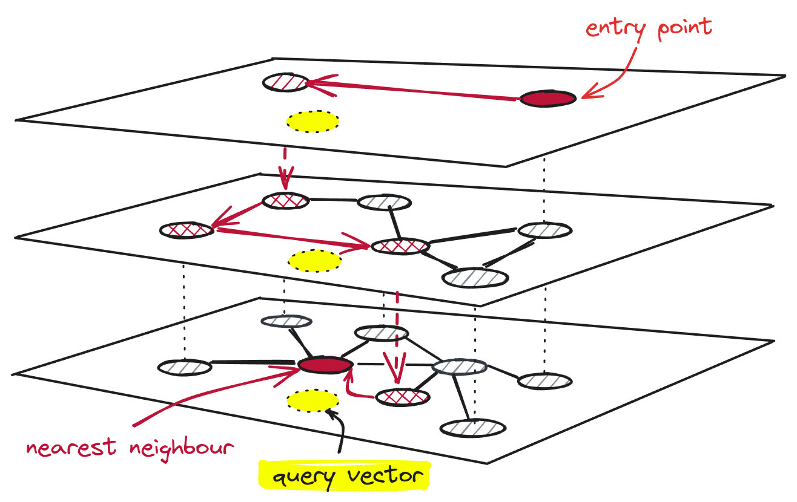
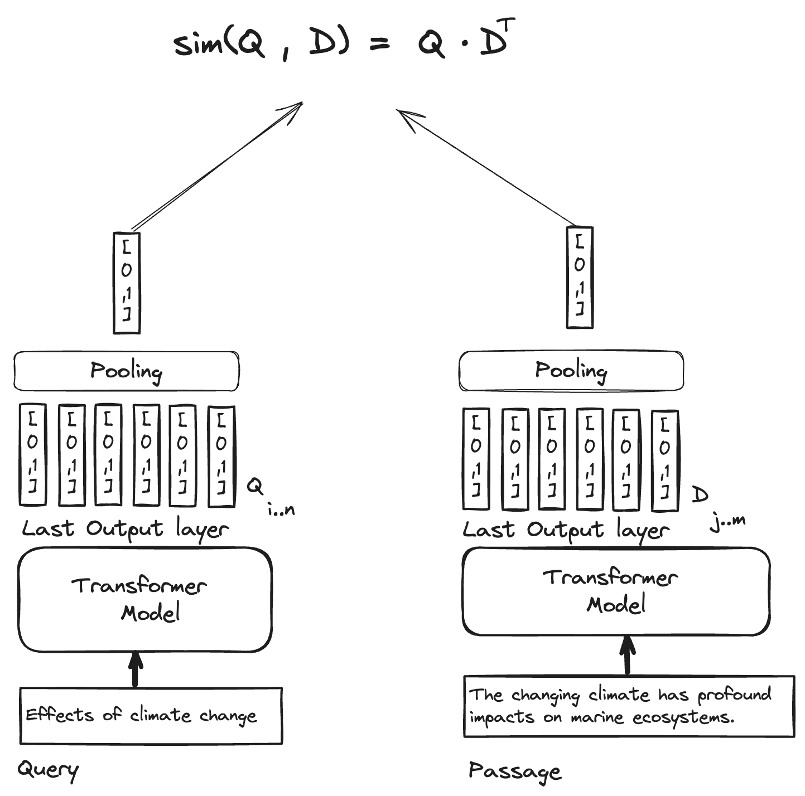
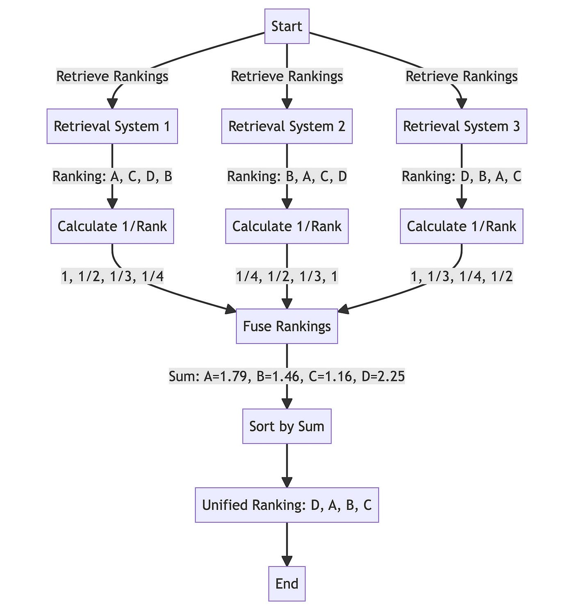
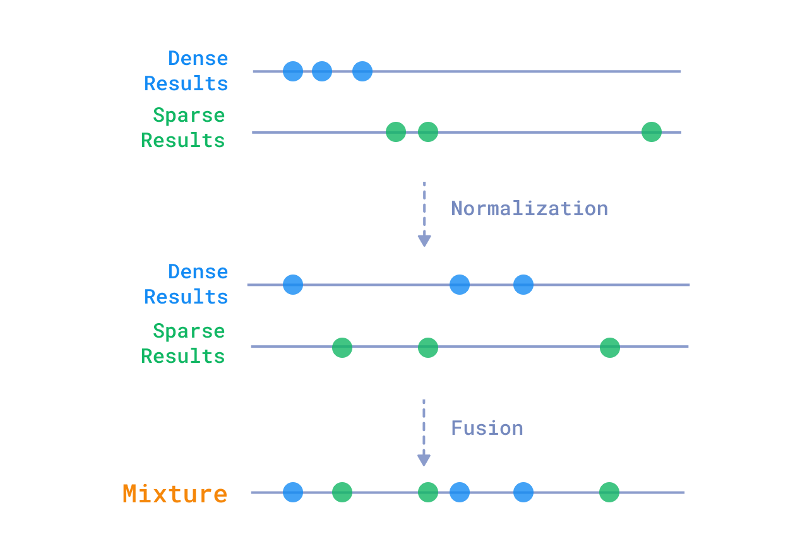

---

## $ whoami


* Kumar Shivendu

* Software Engineer @ Qdrant

* I ❤️ information retrieval, performance, and building tools.

* Topic: Improving vector search relevance with reranking and fusion

<!-- * RAG = Retreival Augment Generation -->

<!-- ---

## Topics to cover

* Evolution of search
  * Traditional approaches and drawbacks
  * Vectors search and how it harnesses ML models

* Qdrant
  * Building HNSW index and vector search
  * Beyond similarity search:
    * Recommendations
    * Discovery
  * Sparse vectors -->
---

## Vectors

* Points in an N-dimensional space
* Anything -> Vector
* Popular ways to generate:
  * Language/vision models
  * Metric learning
    * CLIP


---

## Vector search


* Nearest points
* Example: Google Lens
* Problem: Expensive and not easy to scale
* Solution: Indexing and approximation

<!-- Image showing vector search -->
---

## What is **Qdrant**


* Vector Search Engine (aka Vector DB)

* 18k+ stars on Github

* Written in Rust 🦀

* SDKs for Python, JS, Go, Java, etc

* Twitter, Canva, Meesho, Flipkart

---

## The HNSW Index



* Skip Lists + Graphs
* Approximate and Tunable
* Filter during search
* Quantization

---

## Running search:

```js
POST /collections/rentals/points/search
{
  "query": [0.2, 0.3, 0.4, 0.5], // vector generated from image/text/video
  "filter": { "must": [{"key": "locality", "match": {"value": "Indiranagar"}}] },
  "limit": 10
}
```

* ```js
  [
    {"id": 4, "score": 0.56, "payload": {...}},
    {"id": 2, "score": 0.40, "payload": {...}},
    {"id": 5, "score": 0.23, "payload": {...}},
  ]
  ```

---
## Why care about search (relevance)?
  * R.A.G.
  * Results are only as good as the data (context)
  * Context is limited and costly (latency + $ + quality)
  * Search can be your MOAT
    * Perplexity.ai
    * "Cheating is all you need" by Cody, Sourcegraph
---

## Are vector search results relevant enough?

* Depends
* Vector search is constrained by 2 factors:
  * Embedding model
    * Domain
    * Compression
  * Distance metric
* Tradeoff: Compute
    * Finetune
    * Get 2nd opinion

---

## Reranking:

* Popular in Information Retrieval:
* Two stages:
  * Reterival:
     * Fast but coarse
     * Search **millions** (or billions) of items
     * AKA Candidate generation
  * (Re)ranking:
     * Slow but precise
     * Rank **hundreds** of candidates

---

## Popular rerankers for RAG:

| Model         | Type    | Performance | Cost      | Example                    |
| ------------- | ------- | ----------- | --------- | -------------------------- |
| Rerank API    | Private | Great       | Medium    | Cohere, Mixedbread, Jina   |
| Cross encoder | OSS     | Great       | Medium    | BGE, sentence transformers |
| Multi-vector  | OSS     | Good        | Low       | ColBERT                    |
| LLM API       | Private | Best        | Very High | GPT, Claude                |

---

### Cohere reranker:

```python
import cohere
co = cohere.Client(API_KEY)

query = "What is the capital of the United States?"
docs = [
  {"Title":"Facts about Carson City","Content":"..."},
  {"Title":"The Commonwealth of Northern Mariana Islands","Content":"..."},
  {"Title":"The Capital of United States Virgin Islands","Content":"..."},
  {"Title":"Washington D.C.","Content":"..."},
  {"Title":"Capital Punishment in the US","Content":"..."}
]
results = co.rerank(
  model="rerank-english-v3.0", query=query, documents=docs,
  rank_fields=['Title','Content'],top_n=5, return_documents=True
)
```

---

### Cohere response:

```python
{
  "id": "...",
  "results": [
    {
    	"document": { "Content": "...", "Title": "Washington D.C." },
    	"index": 3,
    	"relevance_score": 0.9987405
    },
    {
    	"document": { "Content": "...", "Title": "Capital Punishment in the US" },
    	"index": 4,
    	"relevance_score": 0.5011778
    },
    {
    	"document": { "Content": "...", "Title": "The Capital of United States Virgin Islands" },
    	"index": 2,
    	"relevance_score": 0.10070161
    },
  ],
  "meta": { ... }
}
```

---

### Cohere reranker finetuning:

* Hard negatives are important

* ```json
  {
    "query": "What are your views on the supreme court's decision to make playing national anthem mandatory in cinema halls?",
    "relevant_passages": ["..."],
    "hard_negatives": [
      "Is the decision of SC justified by not allowing national anthem inside courts but making it compulsory at cinema halls?",
      "Why has the supreme court of India ordered that cinemas play the national anthem before the screening of all movies? Is it justified?",
      "Is it a good decision by SC to play National Anthem in the theater before screening movie?",
      "Why is the national anthem being played in theaters?",
      "What does Balaji Vishwanathan think about the compulsory national anthem rule?"
    ]
  }
  ```

<!-- * [Metrics](https://docs.cohere.com/docs/rerank-understanding-the-results):
  * nDCG@k
  * MRR
  * Accuracy -->
---

### Cross encoder rerankers:


* BGE FlagEmbedding rerankers do well (like their embeddings)
* Can be finetuned
* ```python
  from FlagEmbedding import FlagReranker
  reranker = FlagReranker('BAAI/bge-reranker-v2-m3', use_fp16=True) # use fp16 for speed

  query_passage_1 = ["What is vector search?", "Vector search is cool"]
  query_passage_2 = [
    "What is vector search?",
    ("Vector search is an ML technique that uses vectors to represent data and find "
    "similar items based on their mathematical similarity in a high-dimensional space.")
  ]

  scores = reranker.compute_score([query_passage_1, query_passage_2], normalize=True)
  print(scores) # [0.22970796268567764, 0.9996698472749022]
  ```
* Llama index and other frameworks simplify the interface


---

### ColBERT: Contextualized Late Interaction BERT

<!-- FIXME: Should ideally use/create image that exactly shows ColBERT or it can be confusing -->


* Embedding for each token
* MaxSim
* Surpasses single-vector representations
* Scales efficiently to large documents

---

### Fusion: 2nd way to get 2nd opinion

* Combine with **any** other search results:
  * Vector search with different modalities (image, text, etc)
  * Sparse vector search or BM25
  * Results from any IR system
* Popular algos:
  * Reciprocal Ranked Fusion (RRF)
  * Relative Score Fusion (RSF)
* Python lib `ranx`
---

### RRF: Reciprocal Ranked Fusion



* Ignores relevance scores
* Dampening based on rank

---

### RSF: Relative score Fusion



* Normalize and combine
* Great when score distributions are similar

---

# Summary

* Relevance matters because context is important and costly.
  * Reranking (Serial)
  * Fusion (Parallel)

* Slides: [kshivendu.dev/talks](https://kshivendu.dev/talks)

* Find me at
  * kshivendu.dev/bio
  * kshivendu.dev/twitter


<!--
Further reading:
- https://medium.com/llamaindex-blog/boosting-rag-picking-the-best-embedding-reranker-models-42d079022e83
- https://www.rungalileo.io/blog/mastering-rag-how-to-select-a-reranking-model
-->
