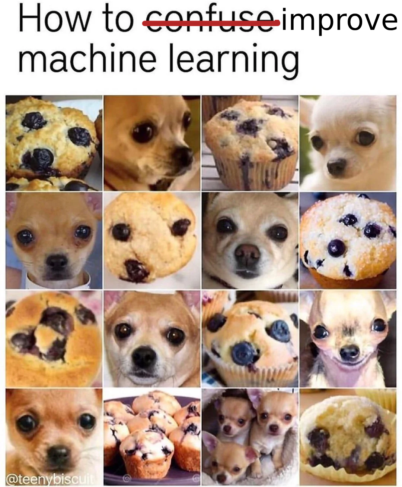

---

## $ whoami


* Kumar Shivendu

* Software Engineer @ Qdrant

* I ❤️ information retrieval, performance, and building tools.

* Topic: Improving vector search relevance with reranking and fusion

<!-- * RAG = Retreival Augment Generation -->

---

## Topics to cover

* Vectors, Vector Search, and Vector DBs
* The HNSW Index
* Why care about search relevance in the age of GenAI?
* Are vector search results relevant enough?
* Reranking
* Fusion

---

## Vectors

* Points in an N-dim space
* Compressed **meaning**
* Anything -> Vector
* Popular ways to generate:
  * Language/vision models
  * Metric learning
    * CLIP


---

## Vector search


* Challenges with keywords
  * Doc miss (low recall)
  * Can't do img, audio, etc
* Similarity = Nearest points
* Faster with indexing and approximation
* Problem: Hard to scale and manage.

<!-- Image showing vector search -->
---

## What is **Qdrant**


* Vector Search Engine (aka Vector DB)

* 18k+ stars on Github

* Written in Rust 🦀

* SDKs for Python, JS, Go, Java, etc

* Twitter, Canva, Meesho, Flipkart

---

## The HNSW Index


* Skip Lists + Graphs
* Approximate and Tunable
* Filter during search
* Quantization

---

## Indexing:

```js
PUT /collections/rentals/points
{
  "batch": {
    "ids": [1, 2],
    "vectors": [
      [0.9, -0.5, ..., 0.0], // generated from rental1.jpg using ML model
      [0.1, 0.4, ..., 0.3],
    ],
    "payload": [
      {"city": "Bangalore", "sqft": 990, "img_path": "img/rental1.jpg", "tags": ["..."]},
      {"city": "Hyderabad", "sqft": 1550, "img_path": "img/rental2.jpg", "description": "..."},
    ]
  }
}
```


---

## Search:

```js
POST /collections/rentals/points/search
{
  "query": [0.2, 0.3, ..., 0.4], // generated from user query (text) using same model
  "filter": { "must": [{"key": "city", "match": {"value": "Bangalore"}}] },
  "limit": 10
}
```

* ```js
  [
    {"id": 4, "score": 0.56, "payload": {...}},
    {"id": 2, "score": 0.40, "payload": {...}},
    {"id": 5, "score": 0.23, "payload": {...}},
  ]
  ```

---
## Why care about search (relevance)?
  * R.A.G.
  * Results are only as good as the data (context)
  * Context is limited and costly (latency + $ + quality)
  * Search can be your MOAT
    * Perplexity.ai
    * "Cheating is all you need" by Cody, Sourcegraph
---

## Are vector search results relevant enough?

* Depends
* Vector search **relevance** is constrained by 2 factors:
  * Embedding model
    * Domain
    * Compression
  * Distance metric
* Tradeoff: Compute
    * Finetune
    * Get 2nd opinion

---

## Reranking for RAG:

* Popular in Information Retrieval.
* Two stages:
  * Reterival:
     * Fast but coarse
     * Search **millions** (or billions) of items
     * AKA Candidate generation
  * (Re)ranking:
     * Slow but precise
     * Rank **hundreds** of candidates. Pick top K (10)

---

## Popular rerankers for RAG:

| Model         | Type    | Quality     | Cost      | Example                    |
| ------------- | ------- | ----------- | --------- | -------------------------- |
| Multi-vector  | OSS     | Good        | Low       | ColBERT                    |
| Cross encoder | OSS     | Great       | Medium    | BGE, sentence transformers |
| Rerank API    | Private | Great       | Medium    | Cohere, Mixedbread, Jina   |
| LLM API       | Private | Best        | Very High | GPT, Claude                |

---

### ColBERT: Contextualized Late Interaction BERT

<!-- FIXME: Should ideally use/create image that exactly shows ColBERT or it can be confusing -->


* Embedding for each token
* MaxSim
* Surpasses single-vector representations
* Scales efficiently to large documents

---

### Cross encoder rerankers:


* BGE flag embedding reranker
* Can be finetuned
* ```python
  from FlagEmbedding import FlagReranker
  reranker = FlagReranker('BAAI/bge-reranker-v2-m3', use_fp16=True) # use fp16 for speed

  query_passage_1 = ["What is vector search?", "Vector search is cool"]
  query_passage_2 = [
    "What is vector search?",
    ("Vector search is an ML technique that uses vectors to represent data and find "
    "similar items based on their mathematical similarity in a high-dimensional space.")
  ]

  scores = reranker.compute_score([query_passage_1, query_passage_2], normalize=True)
  print(scores) # [0.22970796268567764, 0.9996698472749022]
  ```
* Sort based on score

---

### Cohere reranker:

```python
import cohere
co = cohere.Client(API_KEY)

query = "Who is the father of Elon Musk?"
docs = [
  {"Title":"Father (Wikipedia)","Content":"A father is the male parent of a child"},
  {"Title":"Paypal founders","Content":"Elon Musk, Peter Thiel"},
  {"Title":"Musk family","Content":"Elon is son of Errol and Maye Musk"},  # answer
  {"Title":"Peter Thiel","Content":"Peter and Elon built Paypal"},
  {"Title":"Elon musk family","Content":"Elon has 11 children"},
]
results = co.rerank(
  model="rerank-english-v3.0", query=query, documents=docs,
  rank_fields=['Title','Content'],top_n=3, return_documents=True
)
```

---

### Cohere response:

```python
# question: Who's the father of Elon Musk?
{
  "id": "...",
  "results": [
    {
    	"document": {"Title":"Musk family","Content":"Elon is son of Errol and Maye Musk"},
    	"index": 2,
    	"relevance_score": 0.9908034 # 99%
    },
    {
    	"document": {"Title":"Elon musk family","Content":"Elon has 11 children"},
    	"index": 4,
    	"relevance_score": 0.104294725 # 10%
    },
    {
    	"document": {"Title":"Paypal founders","Content":"Elon Musk, Peter Thiel"},
    	"index": 2,
    	"relevance_score": 0.02630528 # 2%
    },
  ],
  "meta": { ... }
}
```

---

### Reranker finetuning:

* Similar to embedding finetuning
* But should be sensitive.
* So hard negatives are imp.
* ```python
  {
    "query": "How many people live in London?",
    "pos": "9M people live in London.",
    "neg": [
      (
        "Around 1.5M people live in ",
        "Cambridge, which is close to London"
      ),
      "...",
    ],
  }
  ```



<!-- * [Metrics](https://docs.cohere.com/docs/rerank-understanding-the-results):
  * nDCG@k
  * MRR
  * Accuracy -->

---

### Fusion: 2nd way to get 2nd opinion

* Combine with **any** other search results:
  * Vector search with different modalities (image, text, etc)
  * Sparse vector search or BM25
  * Results from any IR system
* Popular algos:
  * Reciprocal Ranked Fusion (RRF)
  * Relative Score Fusion (RSF)
* Python lib `ranx`
---

### RRF: Reciprocal Ranked Fusion


* Ignores relevance scores
* Dampening based on rank

---

### RSF: Relative score Fusion


* Normalize and combine
* Great when score distributions are similar

---

# Summary

* Relevance matters because context is important and costly.
  * Reranking (Serial)
  * Fusion (Parallel)

* Slides: [kshivendu.dev/talks](https://kshivendu.dev/talks)

* Find me at
  * kshivendu.dev/bio
  * kshivendu.dev/twitter


<!--
Further reading:
- https://medium.com/llamaindex-blog/boosting-rag-picking-the-best-embedding-reranker-models-42d079022e83
- https://www.rungalileo.io/blog/mastering-rag-how-to-select-a-reranking-model
-->
