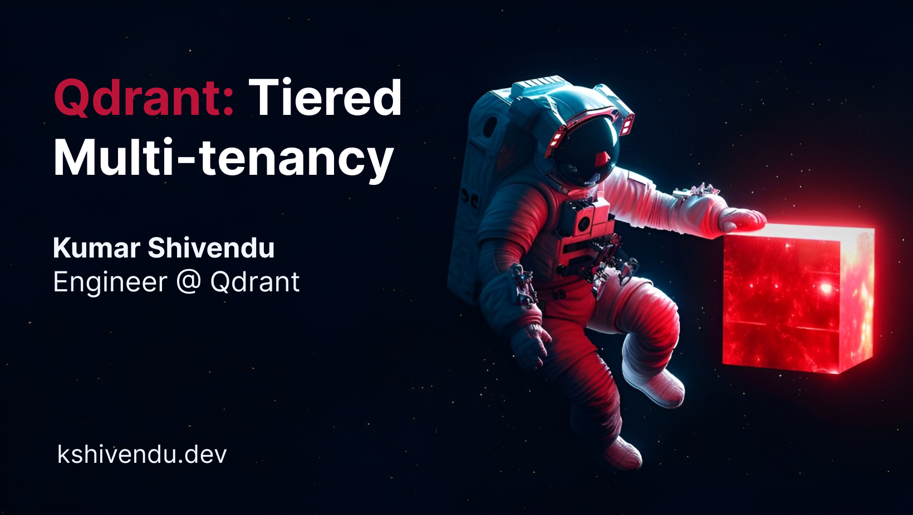

---

### $ whoami


* Kumar Shivendu

* Engineer @ Qdrant

* I ❤️ search, databases, and distributed systems.

* Qdrant: Tiered Multitenancy

---

### Topics to cover

* What is multitenancy?
* Anti-patterns and existing approach
* The problem: Uneven tenant distribution
* Solution: Tiered multitenancy in Qdrant
* Snippets
* Demo
* Q/A

---

### What is Multitenancy?

* Single database cluster serving **multiple tenants**
* Each tenant's data is **isolated** from others
* Common in SaaS applications
* Examples:
  * E-commerce platform like Shopify (each business = tenant)


---

### Anti-pattern: One Collection Per Tenant


---

### Anti-pattern: One Collection Per Tenant

```python
# Create collection for each tenant
for tenant_id in tenants:
    collection_name = f"tenant_{tenant_id}"
    client.create_collection(collection_name, ...)
```

* Problems:
  * Resource overhead per collection
  * Qdrant Cloud limit: **1000 collections per cluster**
  * Management complexity

---

### Better Approach: Payload-Based Partitioning


```python
client.create_collection(
    collection_name="{collection_name}",
    vectors_config=models.VectorParams(size=768, distance=models.Distance.COSINE),
    hnsw_config=models.HnswConfigDiff(
        payload_m=16, # Build graph per tenant
        m=0, # Disable global graph
    ),
)

# Set the tenant field
client.create_payload_index(
    collection_name="{collection_name}",
    field_name="group_id",
    field_schema=models.KeywordIndexParams(
        type=models.KeywordIndexType.KEYWORD,
        is_tenant=True,
    ),
)
```

---

### Let's push some data!

```python
client.upsert(
    collection_name="shared_collection",
    points=[
        PointStruct(id=1, payload={"group_id": "user_1"}, vector=[0.9, 0.1, 0.1]),
        PointStruct(id=2, payload={"group_id": "user_2"}, vector=[0.1, 0.9, 0.1]),
    ],
)

client.search(
    collection_name="shared_collection",
    query_vector=[...],
    query_filter=Filter(
        must=[FieldCondition(key="group_id", match=MatchValue(value="user_1"))]
    ),
)
```

---

### Works well, but...

* Eventually you will get more customers (tenants)
* 

---

### The Parerto Problem

* Real-world tenant sizes vary **dramatically**
* Few large tenants + many small tenants
* Example SaaS platform:
  * 5 enterprise customers: 1M+ vectors each
  * 1000 small customers: 1-5k vectors each
* Large tenants need:
  * Isolated resources
  * Predictable latency
  * More replication for availability and throughput

---

### Tiered Multitenancy

* Introduced in Qdrant 1.16.0
* Two levels of tenant isolation in collection:
  * Small tenants isolated within default shards using payload index.
  * Some large tenants isolated using dedicated shards.
* Tenant promotion: Move tenants from default to dedicated shards
  * Search and upsert continue to work during promotion.

---

### Architecture Overview

* Common shard: Assume named as `default`
* Dedicated shard: Assume named by tenant ID
* Can promote `user_3` from default -> dedicated shard


---

### Create collection

* Must create collection with **sharding_method=custom**
* ```python
  client.create_collection(
      collection_name="{collection_name}",
      sharding_method=models.ShardingMethod.CUSTOM, # IMPORTANT
  )
  ```

---

### Default Shards

* **Shared resource** for small tenants
* ```python
  # Create a shard key
  client.create_shard_key(
      collection_name="{collection_name}",
      shard_key="default",
      shards_number=1, # Single shard limit (for now)
  )
  ```

---

### Dedicated Shards

* **Isolated resource** for large tenants
* One shard per tenant
* Recommended threshold for tenant promotion: **~20K points**

* ```python
  client.create_shard_key(
      collection_name="{collection_name}",
      shard_key="user_3",
      initial_state=ReplicaState.Partial, # IMPORTANT to keep it inactive before promotion
  )
  ```

---

### Upsert/query routing

* Application specifies shard key in request
* Qdrant routes to:
  * Dedicated shard (if exists and `Active`)
  * Fallback shard (otherwise)

---

### Upsert/query routing

```python
# Same shard_key_selector in all queries
# Exists & Active then target, else fallback
client.upsert(
    collection_name="{collection_name}",
    points=[models.PointStruct(id=1, payload={"group_id": "user_3"}, vector=[0.9, 0.1, 0.1])],
    shard_key_selector=models.ShardKeyWithFallback(target="user_3",fallback="default") # SAME
)

client.search(
  collection_name="{collection_name}",
  query_vector=[...],
  filter=Filter(must=[FieldCondition(key="group_id", match=MatchValue(value="user_3"))]),
  shard_key=models.ShardKeyWithFallback(target="user_3", fallback="default"), # SAME
)
```

* Application could store which tenants have been promoted

---

### Tenant Promotion

* Create dedicated shard in `Partial` state
* Replicate tenant data from default to dedicated shard key
* Shard becomes `Active` when transfer finishes
* New requests automatically route to dedicated shard
* Delete tenant data from default shard (optional)
* Benefits:
    * Zero downtime
    * No need to change code
    * Supports reads/writes during transfer

---

### Tenant Promotion Snippets

```python
# Replicate tenant data from fallback to dedicated shard
client.cluster_collection_update(
    collection_name="{collection_name}",
    cluster_operation=models.ReplicatePointsOperation(
        replicate_points=models.ReplicatePoints(
            from_shard_key="default",      # Fallback shard
            to_shard_key="user_3",         # Target shard
            filter=models.Filter(must=[
                models.FieldCondition(key="group_id",match=models.MatchValue(value="user_3"))
            ])
        )
    )
)
```

* Delete data from fallback to free space

---

### So now it's...


---

### Limitations

* Currently, fallback shard can only contain a single shard ID
    * All small tenants must fit on one peer
    * Will be improved soon in future releases
* Collections must be initialized with `sharding_method=custom`
    * Will be resolved soon in future releases.
* Dedicated shards must be initialized with replication factor = 1
    * Although, can Replicate after transfer
* You need to manually promote tenants as they grow
    * Will be automated in Qdrant cloud soon

---

### Summary

* Tiered multitenancy solves for uneven size, traffic, and priority of tenants
* Two-tier architecture: Fallback + dedicated shards
* Seamless promotion without read/write downtime
* Better resource isolation and scaling

* Find me at
  * [kshivendu.dev/twitter](kshivendu.dev/twitter)


---

### References

* [Qdrant Multitenancy Guide](https://qdrant.tech/documentation/guides/multitenancy/#tiered-multitenancy)
* [Qdrant 1.16 Release Notes](https://qdrant.tech/blog/qdrant-1.16.x/)
