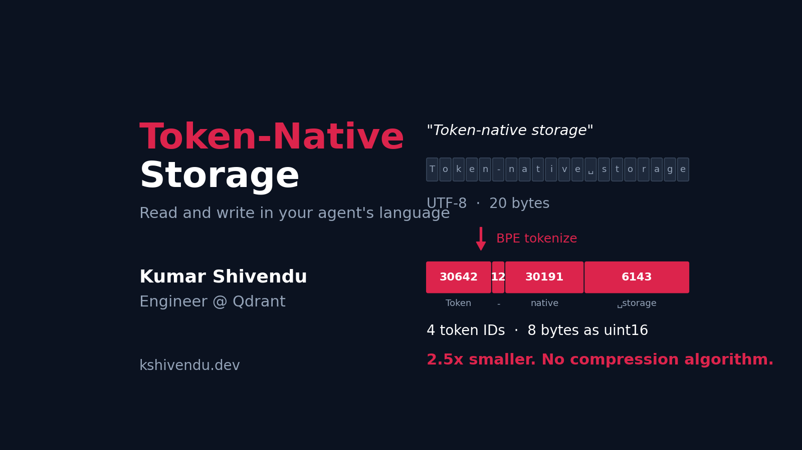
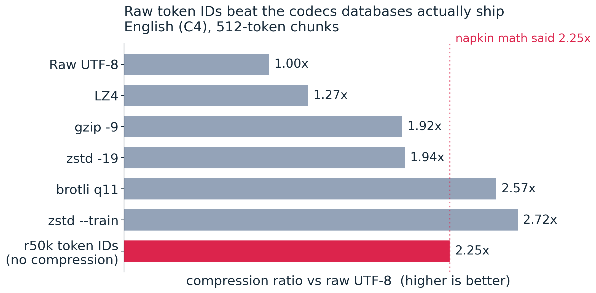
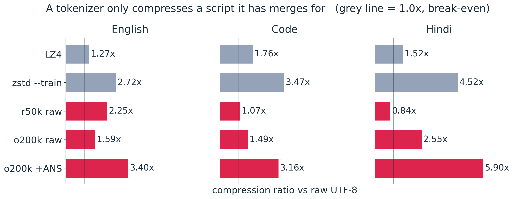
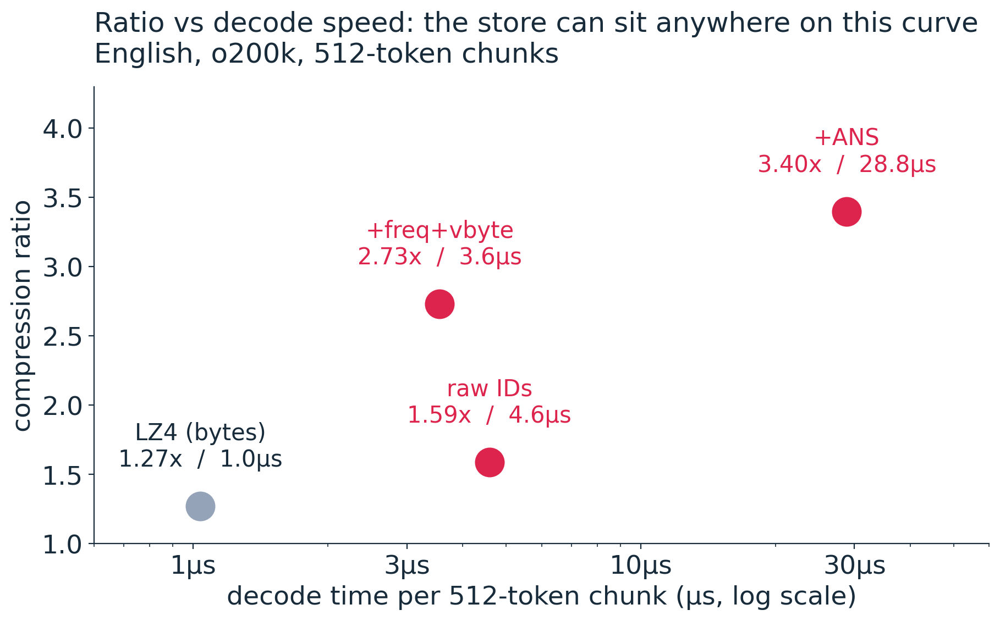
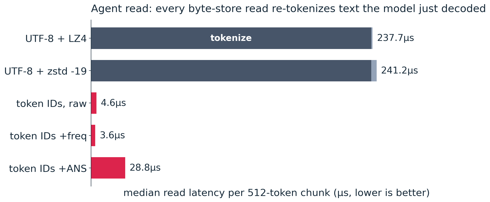
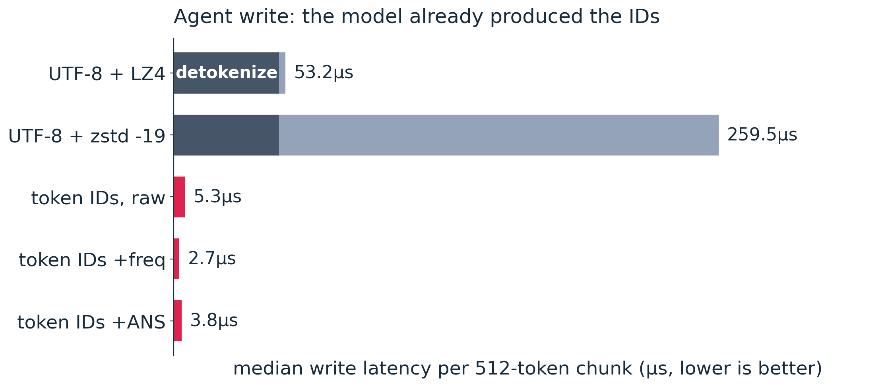

---

## $ whoami


* Kumar Shivendu

* Engineer @ Qdrant

* I ❤️ search, databases, and compression.

* Token-Native Storage

---

## Topics to cover

* Who actually reads your database now?

* The compression ladder, and why every rung falls short

* Tokens as the storage format: free compression

* A bug in every BPE tokenizer

* The agent read/write flip

* What breaks, and what it would cost to ship

---

### Who reads your database now?


* A vector DB record = a **vector** + a text payload

* We compress the vector obsessively: product quantization, binary quantization, Matryoshka

* The text payload gets raw UTF-8, or LZ4 if you're lucky

* But nothing that reads it is human. Embedders, rerankers, LLMs all read **token IDs**

---

### Two representations, paid for twice

```text
   agent writes                                 agent reads
   -----------                                  -----------
   token IDs                                    token IDs
       |  detokenize ~50us                          ^  tokenize ~237us
       v                                            |
   UTF-8 text --> compress --> [ DISK ] --> decompress
```

* The content is stored once, but it exists in **two** representations

* You pay storage for the UTF-8 bytes, and a translation on every single access

---

### Rung 1: what our engines actually do

* Qdrant, Elasticsearch, Postgres: the payload gets an LZ-family codec, usually LZ4

* On English, 512-token chunks: **1.27x**

* Cons:
  * Barely compresses. 100 GB of text becomes 79 GB
  * And every agent read still re-tokenizes

---

### Rung 2: compress harder, then?

* gzip `-9`: 1.92x  ·  zstd `-19`: 1.94x  ·  brotli `q11`: **2.57x**

* Cons:
  * brotli takes **2,777us** to encode one 512-token chunk. That is ~1,000x LZ4's 2.9us
  * zstd `-19` takes 209us to encode, for 1.94x
  * And every agent read still re-tokenizes

---

### Rung 3: train a dictionary on your own corpus

* `zstd --train` learns a 112 KB dictionary from your data, then shares it across documents

* **2.72x** on English, 4.52x on Hindi. The fairest competitor in this talk

* Cons:
  * The dictionary is yours alone. It ships with your data, nobody else can read it
  * 359us to encode
  * And every agent read still re-tokenizes

---

### So what does the model want?

* Every rung ends the same way: **the model re-tokenizes on every read**

* We keep optimizing the container and never question the contents

* What if we stored what the model actually consumes?

---

### The napkin math

```napkin
UTF-8:  5 chars + 1 space = 6 bytes/word x 3/4 word/token = 4.5 bytes/token
Tokens: 1 r50k token ID as uint16          =                2.0 bytes/token

ratio: 4.5 / 2.0 = ~2.25x
```

* One BPE token covers about **3/4 of a word**

* r50k's vocabulary is 50,257 tokens, which fits in a `uint16`

* This is the whole idea. Everything after this slide is checking it

---

## Tokens

* BPE (Byte Pair Encoding) starts from raw bytes and repeatedly merges the most frequent adjacent pair

* `"storage"` is **one** token. `"Token-native"` is three: `Token` + `-` + `native`

* Every word carries its leading space into the token: `" cat"` is 4 bytes of UTF-8, but **1** token

* r50k 50,257 (2 bytes)  ·  cl100k 100,277  ·  o200k 200,019 (3 bytes)

---



---

### Does the napkin math hold?

* Predicted 2.25x. Measured **2.25x**, with no compression algorithm running

* Raw token IDs beat the three codecs databases actually ship: LZ4, gzip, zstd

* Honest: brotli (2.57x) and `zstd --train` (2.72x) still beat raw token IDs

* They cost 2,777us and 359us to encode. Packing a `uint16` costs 5.3us

---



---

### Does it hold beyond English?

* Hindi with o200k: 2.55x raw, **5.90x** with an entropy coder on top

* Hindi with r50k: **0.84x**. Worse than plain UTF-8

* r50k never learned to merge Devanagari, so `भारत` (12 UTF-8 bytes) becomes 7 token IDs = 14 bytes

* The rule: a tokenizer only compresses a script **it has merges for**

---

### Two levers on top of the IDs

* The IDs are just integers now, so you can compress them like integers

* **ANS** (Asymmetric Numeral Systems): an entropy coder. `"the"` is ~40x more common than `"embeddings"`, so it earns a shorter code

* **+freq+vbyte**: re-rank IDs by frequency, then pack with `streamvbyte`, a variable-length integer codec

* One table, trained once on a corpus, reused for every document. Not per-document, or you would ship ~900 bytes of table with each 512-token chunk

---

### A bug in every BPE tokenizer

* BPE hands out IDs in **merge-discovery order**, not by how often a token is used

* A token you use constantly can sit at ID 40,000. A rare one sits at ID 12

* Variable-length integer codecs pay for big numbers. So this ordering costs everyone compression, silently, forever

* Re-ranking by frequency on English: 2.13x → **2.60x**. Half of `+freq`'s gain is the remap alone

---

### Fixing it:

```python
# BPE numbers tokens by merge order. streamvbyte pays for big integers.
# So renumber once, by real-world frequency, and every document gets smaller.
corpus_ids = np.array(enc.encode(corpus_text), dtype=np.int64)
counts  = np.bincount(corpus_ids, minlength=VOCAB)
order   = np.argsort(-counts)                        # most -> least frequent
rank_of = np.empty(VOCAB, dtype=np.uint32)
rank_of[order] = np.arange(VOCAB, dtype=np.uint32)   # token id   -> freq rank
token_of_rank  = order                               # freq rank  -> token id

def compress(text):
    ids   = np.array(enc.encode(text), dtype=np.int64)
    ranks = rank_of[ids]                    # SAME tokens, new numbers
    out = np.zeros(len(ranks) * 2 + 1024, dtype=np.uint32)
    n = codec.encodeArray(ranks, len(ranks), out, len(out))       # streamvbyte
    return len(ranks).to_bytes(4, "big") + out[:n].tobytes()
```

---



---

### Pick your point on the curve

* All o200k here, so `raw` is 1.59x, not the 2.25x from earlier. o200k IDs need 3 bytes; r50k's fit in 2

* `raw IDs`: 1.59x, 4.6us. Free, it's a memcpy

* `+freq+vbyte`: **2.73x, 3.6us**. Most of ANS's ratio, ~8x faster to decode

* `+ANS`: 3.40x, 28.8us. Best ratio, slowest read

* The stored form is just token IDs, so switching between these is a **codec change, not a data migration**

---

### Now: who is reading?

* Everything so far was about size. This part is about who pays the translation

* Same 512-token chunk, same disk. Only the reader changes

* An **agent** wants token IDs. A **human** wants characters

* Whichever form you store, one of them pays

---



---

### Agent read

* LZ4 decompresses in **1.0us**, then spends **236.7us** tokenizing text the model will immediately consume as IDs

* Token-native serves the IDs directly: 3.6us (`+freq`) to 28.8us (`+ANS`)

* That's **~66x** on the fastest token-native path

* Read is where it compounds: it happens on every retrieval, forever. Writing happens once

---



---

### Agent write

* The model **already produced the token IDs**. A byte store throws them away, detokenizes (50.3us), then compresses

* Token-native just stores what it was handed: 2.7-5.3us

* `zstd -19` as a byte store costs 259.5us per write, and 209us of that is the compressor

---

### Detokenize, then tokenize again on every read


---

### But humans still read this data

* True cost: token-native pays ~50us to detokenize before a human sees anything

* But in a RAG or agent loop, a search returns 10 chunks and the agent reads **all** of them

* The human sees one answer, once, at the end

* So detokenize **once**, at the edge. Maybe in the frontend

---

### Works well, but... tokenizers got faster

* This whole read argument assumes tokenizing costs ~237us. That was `tiktoken`

* [gigatoken](https://github.com/marcelroed/gigatoken) is **13.9x faster at encode**, only **1.19x at decode**

* My blog post said a 30M-request/month workload wastes **42 hours/month** re-tokenizing

* With a fast tokenizer that becomes **~1.1 hours/month**. I was off by 38x

---

### So which claims actually survive?

| Claim | Verdict | With gigatoken as the baseline |
| --- | --- | --- |
| Compression | **Intact** | 1.66-1.90x vs today's JSON+LZ4 |
| Write latency | **Intact** | 27.6 → 2.5us (11x) |
| Hot read | Large | 16.5 → 0.17us (95x) |
| Sequential cold read | Modest | 28.9 → 13.9us (2.1x) |
| Random cold read | **Small** | 652.9 → 498.4us (1.3x) |

* The compression and write arguments never depended on a slow tokenizer. Part of the read argument did

---

### Limitations

* **No shared vocabulary.** A token-native payload only pays off end to end if reader and writer use the same tokenizer. Anthropic and Google (except Gemma) haven't open-sourced theirs

* **Hosted LLM APIs take text, not token IDs.** End-to-end only works if you own the inference stack

* **The frequency table is corpus-specific.** A big mismatch between table and corpus costs you ratio

* **WordPiece is not lossless.** mxbai compresses better (3.56x) but 80.4% of articles decode corrupted, mostly BERT's lowercasing: `"Qdrant"` → `"qdrant"`

---

### What would it cost to ship this?

* I costed it against the real Qdrant codebase: **~34 files, ~1,200 new + ~700 modified LOC**

* The obstacle: payloads are `serde_json::Value`, which has no variant for "array of token IDs that is really text"

* So: a **sidecar token store** beside the payload, not a change to the payload type

* Not shipped. This is a design estimate from a working benchmark

---

### Interface: one-time setup

```js
// Register the tokenizer once, per field, at the collection level.
PUT /collections/documents/index
{ "schema": { "text": { "type": "token", "tokenizer": "o200k" } } }
```

* The engine decides internally whether to store raw IDs, `+freq`, or `+ANS`

* Compression happens on write and reverses on read, invisibly

---

### Interface: write and read

```js
// Write: hand over the IDs the model just produced. A plain string also works.
PUT /collections/documents/points
{ "points": [{ "id": 123, "vector": [0.12, -0.34],
    "payload": { "text": [1858, 6427, 20272, 318, 257] } }] }

// Read: ask per field. Default stays "text", so existing clients see no change.
POST /collections/documents/points/search
{ "vector": [0.1], "limit": 10, "with_payload": { "text": "tokens" } }
// -> {"results": [{"id": 123, "text": [1858, 6427, 20272, 318, 257]}]}
```

* An LLM pipeline asks for `"tokens"` and skips detokenization entirely

---

### Two asks for the AI labs

* **Ship token IDs in frequency order.** Sort the vocabulary by corpus frequency before you publish it. It costs a sort, and it gives every downstream user free compression

* **Standardize and publish the tokenizers.** We need a UTF-8-like standard for tokens, so a stored payload isn't locked to one vendor's model version

* You don't have to wait for either. Remap on your own corpus and you'll beat the vendor's ordering anyway

---

### Summary

* A tokenizer that covers your script is **free compression**: 2.25x raw, 3.40x with a coder

* The gain is the tokenizer, not the coder. And BPE's merge-order IDs leave more on the table

* A byte store re-tokenizes on every read. Store what the model speaks

* Find me at
  * [kshivendu.dev/twitter](https://kshivendu.dev/twitter)


---

### References

* Paper: [Token-Native Storage](https://arxiv.org/abs/2608.02376) (arXiv 2608.02376)

* Post: [kshivendu.dev/blog/token-storage](https://kshivendu.dev/blog/token-storage)

* Benchmarks: [github.com/KShivendu/token-storage](https://github.com/KShivendu/token-storage)

* [tiktoken](https://github.com/openai/tiktoken) · [constriction](https://github.com/bamler-lab/constriction) (ANS) · [streamvbyte](https://github.com/lemire/streamvbyte) · [gigatoken](https://github.com/marcelroed/gigatoken)

* Kalcher, *Compressing token IDs with frequency ordering* (2026) · NVIDIA [Megatron-Core](https://github.com/NVIDIA/Megatron-LM) tokenized `.bin` corpora

<!--
CUT FOR TIME, in the order I'd drop them:
  1. "Does it hold beyond English?" prose slide (keep the chart, say it out loud)
  2. "Two levers on top of the IDs" (fold into the frontier slide)
  3. "What would it cost to ship this?" (only lands with a DB-heavy room)

CUT ENTIRELY, available if asked in Q&A:
  * Generality across 6 tokenizers: r50k/cl100k/o200k/Qwen2.5/DeepSeek-V2/Gemma-2
    all land in a 3.30-3.40x band with static ANS. Vocab size doesn't predict
    the winner: Gemma has the biggest vocab and comes out lowest.
  * Decorrelation: order-0 over tokens beats order-1 over bytes on prose
    (2.44 vs 3.68 bits/byte). BPE folds adjacent-byte dependence into the alphabet.
  * The n-gram wall: prose 3.28x unigram -> 3.97x bigram -> 4.01x trigram.
    Trigram triples the table for +1%. LM ceiling is ~12x (Deletang 2024).
  * Free OOD gate: ANS already computes -log2 P(token), so you get a per-chunk
    bits/token score for nothing. Cross-domain AUC 0.97-1.00.
  * Cost at scale: 1B docs, 1000-word average = 6.0 TB raw, 4.7 TB with LZ4
    (~$4.5k/yr SSD), 2.2 TB with o200k+freq+vbyte (~$2.1k/yr).
  * Chunk-size sweep: order-0 token ratios are flat across 256/512/2048/4096.
    LZ-family methods climb; zstd --train only catches +freq+vbyte at 4096 tokens.

MEASUREMENT CAVEAT, if anyone asks how the latency was measured:
  Single-core, P-core pinned (taskset -c 4, RAYON_NUM_THREADS=1). On this hybrid
  CPU an unpinned run lands on an LP-E core and every cell inflates ~1.6x.
  Tokenize is measured SERVING-COLD: a 64 MB cache sweep before each shot, so the
  rank table is evicted the way it is in real serving. A back-to-back tokenize
  loop reports roughly HALF the real cost.
-->
